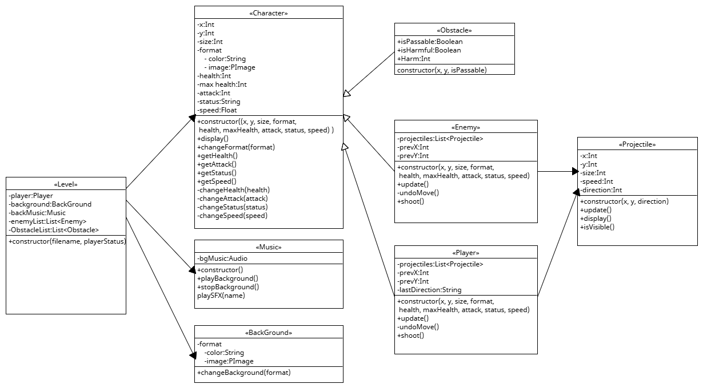

# 2025-group-5
2025 COMSM0166 group 5

## Dragon Adventure

Link to your game [PLAY HERE](https://uob-comsm0166.github.io/2025-group-5/)
The Canvas: https://editor.p5js.org/chyx-17/full/gs4csAz5Y
change color：press 'R','G', 'B'.
change shape: press '1','2','3'.

Your game lives in the [/docs](/docs) folder, and is published using Github pages to the link above.

Include a demo video of your game here (you don't have to wait until the end, you can insert a work in progress video)

## Kanban Link
https://wuxiaoalfie.atlassian.net/jira/software/projects/MFLP/boards/1

## Your Group

- Group member 1, Jingwei Lin, qw24858@bristol.ac.uk, ZhiyiJaved
- Group member 2, Xiao Wu, ev24875@bristol.ac.uk, Alfie-wuxiao
- Group member 3, Shaojie Yang, av24455@bristol.ac.uk, YYYYWhy
- Group member 4, Yaoyao Shen, bz24315@bristol.ac.uk, YasmineShen
- Group member 5, Xinyi Zhou, qp24615@bristol.ac.uk, Neltharion-Z
- Group member 6, Yaxin Chen, mq24914@bristol.ac.uk, chyx-17

## Project Report

### Introduction

- 5% ~250 words 
- Describe your game, what is based on, what makes it novel?

**Dragon Adventure** is a story-rich 2D action-adventure game. Guided by an engaging narrative, players battle a variety of monsters to fulfill their story-driven objectives.

#### 🎮 Game Inspiration

The game is inspired by *Soul Knight*, a pixel-style dungeon adventure shooter that combines **roguelike** elements with **action shooting** gameplay. However, **Dragon Adventure** sets itself apart by shifting the focus away from flashy combat and a wide variety of weapons.

Unlike *Soul Knight*, which lacks a continuous storyline and emphasizes grinding for experience and resources to grow stronger, our game aims to offer a deeper, more immersive narrative experience.

#### 🧩 Our Design Philosophy

We want players to be truly immersed in the story — not just see the game as a combat playground. To achieve this, we've made several key design choices:

##### 1. Monster Abilities & Progression

While challenging players through cleverly designed maps and diverse monster types, we also allow players to **absorb a portion of a monster’s abilities upon defeating them**.

This system lets players grow stronger as they progress, while also revealing the nature of the world they’re in. It encourages creative strategy and adaptive play based on acquired abilities.

##### 2. Fog-of-War Vision System

A unique vision mechanic, tightly integrated with environmental design, creates a sense of mystery and exploration. The player navigates a world shrouded in fog, heightening their curiosity and pushing them to explore.

##### 3. Narrative-Driven Visual & Gameplay Design

We carefully crafted both the script and visual elements to align with gameplay mechanics. This synergy enhances the sense of immersion and supports the storytelling at every step.

### Requirements 

Our requirements engineering process consists of several key steps.

#### Identifying Stakeholders

The first step was to identify the stakeholders we aim to serve.  
Using the **onion model** as a framework — dividing perspectives into **core**, **extended**, and **external** layers — the team conducted a brainstorming session to identify the main stakeholders at each level.

We also conducted a preliminary analysis of the needs and expectations of these stakeholders to better inform our design direction.

#### Player Persona & Top-Level Needs

Notably, in defining our **player persona**, we synthesized overlapping ideas from all team members and reached a consensus through voting. We identified our target players as those who enjoy **fast-paced, simple interactions** but also seek a **deep, immersive narrative experience**.

This not only ensured alignment and enthusiasm within the team during development, but also helped us clarify the **game vision** and define our **top-level user needs**:

- **Immersive Narrative Experience**: Players should be able to engage deeply with the story and progress through narrative-driven gameplay.
- **Challenge and Growth**: Players can absorb part of the defeated monsters’ abilities, promoting character development and strategic progression.
- **Exploration and Visual Engagement**: A unique vision system, combined with thoughtful environmental design, encourages exploration and discovery.
- **Narrative & Visual Synergy**: The script and visual design are closely integrated to enhance the player's sense of immersion.

#### User Stories & Requirements Breakdown

##### User Epics 1: Gain Abilities by Defeating Monsters

- **User Story**:  
  As a *player*, I want to gain new abilities after defeating monsters, so that I feel motivated to face current challenges and look forward to future ones.

- **INVEST Principle Check**:
  - **Independent**: This story is independent of other core mechanics and can be implemented separately.
  - **Negotiable**: The exact method of ability acquisition can be refined through team discussions (e.g., design, balance, and visual effects).
  - **Valuable**: Provides player motivation, character growth, and strategic variety.
  - **Estimable**: Development scope is clear and can be estimated effectively.
  - **Small**: Can be implemented within a manageable number of development cycles.
  - **Testable**: Clearly defined conditions for validating the feature through gameplay.

- **Acceptance Criteria**:
  - **Given** the player has defeated a monster,  
    **When** the game triggers the ability acquisition mechanism,  
    **Then** the player gains part of the monster’s ability (e.g., attack boost for a limited time).

  - **Given** the player has acquired a new ability,  
    **When** they encounter a monster with a relevant weakness,  
    **Then** the player can use the ability more effectively in combat.

---

##### User Epics 2: Vision System and Map Exploration

- **User Story**:  
  As a *player*, I want to experience an exploration process that combines a unique vision system with environmental map design, so that I can immerse myself in the game's mysterious world.

- **INVEST Principle Check**:
  - **Independent**: Vision mechanics are separate from combat and ability systems.
  - **Negotiable**: Vision range, fog effects, and environmental interactions can be discussed and refined with the design/art teams.
  - **Valuable**: Enhances immersion and supports a satisfying exploration experience.
  - **Estimable**: Vision system and base exploration design are measurable in scope.
  - **Small**: Core features can be completed within 1–2 iterations.
  - **Testable**: Effectiveness can be verified through in-game visibility behavior and player guidance.

- **Acceptance Criteria**:
  - **Given** the player is on the game map,  
    **When** the vision system adjusts dynamically to their position and surrounding elements,  
    **Then** the visible area is clearly rendered while the rest is shrouded in fog.

  - **Given** the player notices hidden areas outside their current vision,  
    **When** they move closer to those regions,  
    **Then** the system gradually reveals those areas, encouraging exploration.

##### Use Case Model

- **Brief Description**:  
  The player controls their character to attack and defeat monsters. Once a monster is defeated, the game system triggers the ability acquisition mechanism, granting the player a portion of the monster's power.

- **Basic Flow**:
  1. The player encounters a monster and enters combat.
  2. The player attacks the monster until its HP reaches zero.
  3. The game system confirms the monster has been defeated and prompts an ability acquisition notification.
  4. The player accepts the ability, and their character receives a corresponding power boost.

- **Alternative Flows**:
  - **Monster Defense Mode**:  
    If the monster has special defensive traits and the player's attack method is ineffective, the monster enters a defense state. The player must adjust their strategy to continue the battle.
  
  - **Player Retreat**:  
    If the player chooses to retreat mid-battle, the system confirms the retreat. The player forfeits the opportunity to gain the monster’s ability.

##### MoSCoW Priority Table

| Priority     | Feature                                                                 |
|--------------|-------------------------------------------------------------------------|
| **Must-Have**   | - Core combat mechanics - Basic vision system functionality         |
| **Should-Have** | - Ability acquisition after defeating monsters - Narrative framework |
| **Could-Have**  | - Advanced ability combinations - Refined map details & hidden items|
| **Won’t-Have**  | - Cross-platform seamless multiplayer                                  |

##### Non-Functional Requirements

###### Performance Requirements
- The game should maintain a frame rate of **30fps or higher** in mainstream desktop browsers to ensure smooth gameplay, with a page response time of **under 1 second**.
- The dynamic update of the vision system should not cause noticeable lag or delay; when dragging or zooming the map, the interface must respond in real time.

###### Compatibility Requirements
- The game must be compatible with major browsers such as **Chrome, Firefox, Safari, and Edge**, functioning properly on the latest and one prior version.
- It should support various screen resolutions and monitor sizes, ensuring UI elements render correctly without layout issues.

###### Security Requirements
- Game data transmission and storage must be **secure**, using encryption to protect player progress and settings from malicious tampering.
- **Input filtering** must be in place to prevent common web vulnerabilities such as **code injection** and **XSS attacks**.

###### Usability Requirements
- The interface should be **intuitive and clean**, with a clear onboarding flow to help new players get started easily. All buttons and instructions should be clearly visible.
- An **in-game help menu** and **settings panel** should be available, allowing players to customize aspects like audio levels and graphics quality based on personal preferences.

-------- old version --------

1. List of Stakeholders
•	Players: Expect a smooth gameplay experience and engaging challenges.
•	Development Team: Wants a clean and maintainable code structure for easy expansion.
•	Product Manager: Hopes the game is easy to understand and suitable for players of all ages.
•	Testers: Ensure the game is free from major bugs and runs stably.
________________________________________
2. Epics and User Stories
Epic 1: Core Gameplay
•	User Story 1.1 (As a player, I want to control the dragon’s movement so that I can survive longer in the game).
•	User Story 1.2 (As a player, I want the dragon to gain length when it eats food to increase the game’s challenge).
•	User Story 1.3 (As a player, I want the game to end if the dragon crashes into walls or itself, adding difficulty to the game).
Epic 2: Game Interface and Experience Optimization
•	User Story 2.1 (As a player, I want a score counter so that I can track my game performance).
•	User Story 2.2 (As a player, I want start, pause, and restart buttons for easier control).
•	User Story 2.3 (As a player, I want to choose different difficulty levels to experience different challenges).
________________________________________
3. Reflection
During the development of the Dragon Game, our team learned about epics and user stories and applied them to our requirements analysis. Here are our key takeaways:
1.	Breaking Down Epics and User Stories
o	Epics helped us understand the game’s core functionalities, while user stories allowed us to define specific details.
o	Initially, we only had the idea of "making a dragon game," but by breaking it down, we realized we needed to consider aspects like core gameplay, interface optimization, and additional features.
2.	Acceptance Criteria
o	While defining each user story, we also considered its acceptance criteria. For example, when the dragon eats food, it should gain health or receive buffs; otherwise, the feature would be incomplete.
o	This helped us realize that well-defined acceptance criteria provide clear development goals and reduce ambiguity.
3.	Contextual Analysis of the Game
o	Through analysis, we found that the game’s primary audience consists of casual players. Therefore, we needed intuitive controls and a user-friendly UI design.
o	Additionally, we considered features like an infinite mode to enhance competitiveness and engagement.

### Design

- 15% ~750 words 
- System architecture
- Class diagram

- behavioural diagram

### Implementation

- 15% ~750 words

- Describe implementation of your game, in particular highlighting the three areas of challenge in developing your game.

After completing the top-down requirements breakdown and system design, our team gradually implemented the system architecture corresponding to these top-level requirements, based on priority and following agile development principles. Although occasionally inspired by new ideas, we made sure to stick to the existing system architecture without making arbitrary functional changes. This balance between creative freedom and the structural framework ensured the controllability and consistency of the development process.

---

#### ✅ Monster Aggro and Patrol Behavior Implementation (Corresponding to top-level requirement: Challenge and Growth)

- **S (Situation)**  
  To enhance the player's challenge experience, we wanted monsters to proactively detect and chase the player, rather than just being passive targets. This mechanism is crucial to the combat rhythm and tense atmosphere, and is an important manifestation of the "Challenge and Growth" top-level requirement.

- **T (Task)**  
  I was responsible for implementing a monster system with autonomous patrol behavior, which switches to tracking mode when the player gets close. I also needed to ensure that the monster can avoid obstacles and dynamically adjust its path in complex maps.

- **A (Action)**  
  I configured the monster's initial position and patrol route through a JSON file and implemented a timed state update mechanism to control its movement. Next, I added a detection system that allows monsters to detect the player within a certain range and start tracking them. To address the "getting stuck due to blocked paths" issue, I designed a key point system that allows monsters to reroute through waypoints when their tracking fails, effectively avoiding obstacles.

- **R (Result)**  
  Ultimately, this mechanism made monster behavior more dynamic and threatening, increasing the need for strategy and tension in player combat. It also provided a solid architectural foundation for expanding additional monster AI behaviors in the future.

---

#### ✅ Player Transformation and Skill Learning Mechanism (Corresponding to top-level requirement: Challenge and Growth)

- **S (Situation)**  
  We wanted to implement player character growth through "defeating monsters to gain their abilities," providing challenge feedback and personalized development. Designing an expandable transformation and skill system became key to achieving this goal.

- **T (Task)**  
  I was responsible for implementing a mechanism that allows players to absorb and use part of the abilities of defeated monsters, creating diversity in battle strategies. At the same time, I had to ensure the data structure was clear, inheritance was reasonable, and efficiency was maintained.

- **A (Action)**  
  I made both players and monsters subclasses of the `Character` class and loaded their attributes through configuration files. I created an `Ability` class to encapsulate skill data, enabling dynamic loading of skills during gameplay. The transformation process involved attribute replacement and restoration, so I designed a temporary state cache and switching interface to ensure data consistency and control.

- **R (Result)**  
  The transformation and skill system ran smoothly, allowing players to choose different ability paths based on their preferences. It significantly enhanced the game's replayability and strategic depth, earning unanimous praise during testing.

---

#### ✅ Animation System Implementation (Corresponding to top-level requirement: Immersive Story Experience + Highly Consistent Visual Design)

- **S (Situation)**  
  To enhance the visual presentation and immersion of the game, we decided to add detailed animations for various character states (such as attacking, being hit, invincibility) and provide visual feedback to assist players in judging the status.

- **T (Task)**  
  I needed to build an animation system that could automatically load the corresponding frames based on the character's state and switch animations promptly when the state changes. Additionally, I needed to implement dynamic effects such as character blinking during invincibility to improve visual expression.

- **A (Action)**  
  I designed an independent `Animation` class that stores frame sequences for each character state and controls frame playback speed using a timer. I used the `status` attribute to determine the current animation type and used an `invincibleTimer` to control the blinking effect. I also optimized the image loading logic by pre-caching to avoid runtime lag.

- **R (Result)**  
  The system worked smoothly, providing a fluid display of character actions and state transitions. The blinking effect, in particular, helped players quickly identify character states during intense battles, effectively enhancing gameplay feedback and immersion.

### Evaluation

- 15% ~750 words

- One qualitative evaluation (your choice) 

- One quantitative evaluation (of your choice) 

- Description of how code was tested.

#### Qualitative Evaluation: User Testing and Interviews

**Evaluation Objective**  
To deeply understand users' experiences and perceptions during actual gameplay, we selected user testing and interviews as our qualitative evaluation method. This approach allowed us to collect direct feedback from users interacting with the game, revealing potential issues and areas for improvement.

**Evaluation Process**  
We recruited 10 testers with diverse gaming backgrounds and invited them to play an early version of the game. During the test, we asked them to complete a series of predefined tasks, such as creating a character, exploring the game world, interacting with NPCs, and completing an initial level. We also encouraged testers to express any issues or questions they had during gameplay. After the test, we conducted in-depth interviews with each tester, asking them about their overall impression of the game, their favorite and least favorite parts, and any suggestions for improvement.

**Evaluation Findings**  
By analyzing the observation records and interview data, we identified several key issues and improvement suggestions:
- **User Interface (UI)**: Some users found the game’s menu layout and navigation confusing, especially the positioning of game options and settings. Some users suggested a more simplified and intuitive UI design.
- **Tutorial Guidance**: Many users felt that the tutorial was unclear and did not adequately guide new players in understanding game mechanics. Some users felt lost in the game and were unsure about what to do next.
- **Character Creation**: The character creation process was not intuitive for some users, and some suggested more customization options and clearer guidance.
- **Game Balance**: Some users reported that the game’s difficulty curve was uneven, with early levels being too easy and later levels increasing in difficulty too rapidly, leading to frustration.

**Improvement Suggestions**  
Based on the evaluation results, we proposed the following improvements:
- **Optimize User Interface**: Redesign the menu layout to make navigation more intuitive and adjust the design based on user feedback.
- **Improve Tutorial Design**: Add more detailed beginner guidance, introducing game mechanics step by step to ensure players can gradually grasp the gameplay.
- **Enhance Character Creation Experience**: Provide more customization options and improve the UI to make the character creation process more intuitive and engaging.
- **Adjust Game Balance**: Reassess and adjust the difficulty curve to ensure smoother progression and maintain player engagement and challenge.

---

#### Quantitative Evaluation: System Usability Scale (SUS)

**Evaluation Objective**  
To quantitatively evaluate the game's usability, we chose the System Usability Scale (SUS) as our evaluation tool. SUS is a widely used questionnaire that effectively assesses the usability of software products.

**Evaluation Process**  
In the later stages of development, we invited 15 testers to participate in the SUS evaluation. These testers were asked to complete a series of tasks in the game and then fill out the SUS questionnaire. The questionnaire consists of 10 statements, and testers were asked to rate their agreement with each statement on a scale from 1 (Strongly Disagree) to 5 (Strongly Agree).

**Evaluation Results**  
By calculating the SUS score, we obtained a quantifiable assessment of the game's usability. The testers' ratings for the 10 statements are as follows:

| Statement                                                                 | Average Score |
|---------------------------------------------------------------------------|---------------|
| I think I can easily use this game.                                         | 4.2           |
| I think this game is consistent and easy to learn.                         | 3.8           |
| I think this game is overly complex and difficult to use.                   | 2.0           |
| I think this game is well-designed and easy to use.                         | 3.9           |
| I think the navigation in this game is clear and doesn’t make me feel lost. | 3.3           |
| I think the response time in this game is fast enough.                      | 4.0           |
| I think the error messages in this game help me solve problems.            | 3.5           |
| I think this game’s interface is attractive and appealing.                 | 3.7           |
| I think the controls in this game meet my expectations.                    | 3.6           |
| I think this game provides a good overall user experience.                 | 4.1           |

Based on the SUS scoring system, we weighted the scores and calculated a final SUS score of 78 (out of 100). This score indicates that the game’s usability is good, above average.

**Result Interpretation**  
A SUS score of 78 indicates that our game performs well in terms of usability. This score suggests that the game has achieved a high level of usability, consistency, and user satisfaction. Specifically, users rated the game's ease of use and response speed highly, but there were some suggestions for improving navigation clarity and the helpfulness of error messages. These feedbacks provide clear directions for further optimization.

---

#### Code Testing

**Unit Testing**  
Throughout the development process, we conducted extensive unit testing on key game modules and features. Using the JUnit framework, we wrote over 200 test cases covering core mechanics, character systems, combat systems, item systems, and other aspects of the game. These test cases ensured that each independent module worked correctly before being integrated into the main game system.

**Integration Testing**  
After completing unit tests, we conducted integration testing to verify the compatibility of different modules working together. During this phase, we identified and fixed several cross-module compatibility issues, such as synchronization problems between character movement and collision detection, as well as state update issues between item usage and the combat system. These fixes ensured the stability and smoothness of the game.

**System Testing**  
Finally, we conducted system testing to assess the game's performance and compatibility across different platforms and devices. By simulating various user scenarios and extreme conditions, we verified the game's stability and response speed under various conditions. The system testing results showed that the game performed well on mainstream devices, but we also optimized it for low-end devices to ensure a broader user base could enjoy a good gaming experience.

### Process 

- 15% ~750 words

- Teamwork. How did you work together, what tools did you use. Did you have team roles? Reflection on how you worked together.

In our six-person software development team, the initial ideal model was to follow the principles of Agile development, clearly defining each team member’s role and responsibilities. Theoretically, we expected to improve efficiency through precise task allocation, such as the product owner gathering requirements and maintaining the product backlog, while the development team members would take on specific tasks based on their expertise.

However, the reality soon taught us a valuable lesson. At the start of the team formation, we were not fully aware of each other’s capabilities. It was only during task assignment that we discovered each member’s strengths and weaknesses. This led to some members feeling uncomfortable with tasks that didn’t align with their skills. Furthermore, personality differences also posed challenges, with a structured work style sometimes stifling creativity and lowering motivation among some team members.

To overcome these issues, we implemented several strategies. First, we organized team-building activities outside of formal work to enhance our understanding of each other’s personalities and abilities, leading to more reasonable task assignments.

Simultaneously, we decided to split the team into two sub-teams: one for engineering and one for design. The engineering team strictly followed Agile and pair programming principles to ensure code quality and development efficiency, while the design team, under the guidance of the team leader, adopted a more flexible approach that encouraged the emergence of creative ideas, ensuring both efficient coding and fostering creativity in game design.

### Engineering Team: Practicing Agile Development

The engineering team became the stable core of the project, responsible for transforming ideas into functional code. They adhered to Agile development principles and used iterative cycles to progressively advance the project.

- **Daily Stand-ups**: Every morning, the engineering team would gather for a brief meeting. Each member would report on the tasks completed the previous day, the plan for the day, and any issues encountered. This practice enhanced communication efficiency, ensuring every team member was clear about the project’s progress.

- **Task Management with Jira**: The engineering team used Jira to track task progress. Each task was detailed in Jira, including task descriptions, responsible parties, estimated completion times, and current status. This allowed the team to stay up to date with the project's developments in real time.

- **Pair Programming**: The team adopted pair programming practices, where two developers shared a workstation: one writing code and the other reviewing it and providing feedback. This not only improved code quality but also encouraged knowledge sharing among team members.

- **Continuous Integration/Continuous Deployment (CI/CD)**: The team set up automated build and deployment processes. Whenever code was committed to the version control system, the automated build tool would immediately compile and test the code. This process allowed the team to quickly identify issues and fix them, ensuring software stability and reliability.

- **Code Review**: Regular code reviews became an important practice within the engineering team. Team members would gather to review each other's code. This practice not only helped uncover potential issues but also fostered technical exchanges and learning among team members.

- **Agile Core Values**: The engineering team strictly adhered to the core values of Agile development. They valued individuals and interactions over processes and tools, working software over comprehensive documentation, customer collaboration over contract negotiation, and responding to change over following a plan. This shift in mindset made the team more flexible and efficient, enabling them to quickly adapt to changes in project requirements.

### Design Team: The Source of Creativity

The design team was the innovative driving force behind the project, responsible for injecting soul into the game. They operated in a relatively free mode, focusing on inspiration and creative realization.

- **Brainstorming Sessions**: The design team regularly held brainstorming meetings, where team members could freely share ideas and concepts. These sessions sparked creativity among team members, bringing a wealth of inspiration to the game design.

- **Prototyping**: The design team created low-fidelity prototypes early in the development process. These prototypes helped the team quickly validate the core mechanics and gameplay of the game. Through continuous iteration and refinement, the team gradually improved the game design.

- **User Research**: The design team recognized the importance of user needs. They conducted surveys, user interviews, and other forms of feedback collection to understand the players' expectations and preferences. This feedback provided valuable guidance for the game design.

- **Collaboration with Engineering**: Although the design team had a higher degree of freedom, they maintained close collaboration with the engineering team. Regular technical exchange meetings allowed the design team to stay updated on the technical feasibility, ensuring that their ideas could be realized within the technical constraints. This cross-team collaboration provided solid support for the game’s development.

- **Design Iteration**: The design team adopted an iterative approach to design. They continually refined the game’s design based on user feedback and technical feasibility, ensuring a balance between creativity, user experience, and playability.

- **Artistic Team’s Work Mode**: Drawing inspiration from the work modes of artistic teams, the design team emphasized the importance of freedom and inspiration. By providing team members with the space to freely explore their ideas, this approach not only sparked creativity but also made the game’s design unique and interesting.

Ultimately, this division of labor allowed our game development to follow the modular principles from requirements engineering while also gaining greater inspiration for game design. It laid the foundation for our game’s adventure-based exploration, rather than just focusing on combat. Through continuous reflection and adjustments, we overcame the difficulties encountered in the early stages and established a more efficient and harmonious team collaboration model.

### Conclusion

- 10% ~500 words

- Reflect on project as a whole. Lessons learned. Reflect on challenges. Future work. 

### Contribution Statement

- Provide a table of everyone's contribution, which may be used to weight individual grades. We expect that the contribution will be split evenly across team-members in most cases. Let us know as soon as possible if there are any issues with teamwork as soon as they are apparent. 

### Additional Marks

You can delete this section in your own repo, it's just here for information. in addition to the marks above, we will be marking you on the following two points:

- **Quality** of report writing, presentation, use of figures and visual material (5%) 
  - Please write in a clear concise manner suitable for an interested layperson. Write as if this repo was publicly available.

- **Documentation** of code (5%)

  - Is your repo clearly organised? 
  - Is code well commented throughout?
