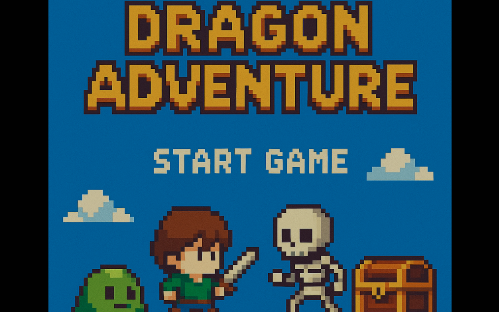
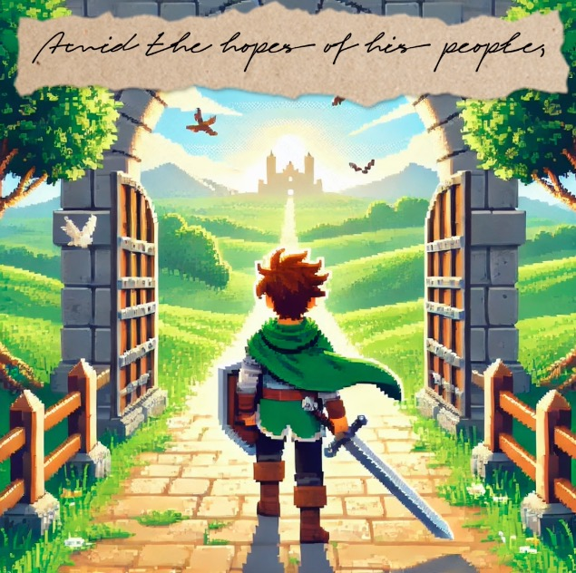

# 2025-group-5
2025 COMSM0166 group 5

## Dragon Adventure

Link to our game [PLAY HERE](https://uob-comsm0166.github.io/2025-group-5/)

Our game lives in the [/docs](/docs) folder, and is published using Github pages to the link above.

Include a demo video of our game here [Video Demonstration](https://www.youtube.com/watch?v=tdPnVR722zU)

<p align="center">
  <a href="https://www.youtube.com/watch?v=tdPnVR722zU">
    
  </a>
</p>

## Kanban Link
https://wuxiaoalfie.atlassian.net/jira/software/projects/MFLP/boards/1

## Your Group


- Group member 1, Jingwei Lin, qw24858@bristol.ac.uk, ZhiyiJaved
- Group member 2, Xiao Wu, ev24875@bristol.ac.uk, Alfie-wuxiao
- Group member 3, Shaojie Yang, av24455@bristol.ac.uk, YYYYWhy
- Group member 4, Yaoyao Shen, bz24315@bristol.ac.uk, YasmineShen
- Group member 5, Xinyi Zhou, qp24615@bristol.ac.uk, Neltharion-Z
- Group member 6, Yaxin Chen, mq24914@bristol.ac.uk, chyx-17

## Project Report
- [1. Introduction](#introduction)
- [2. Game Content](#game_content)
- [3. Requirements](#requirements)
- [4. Design](#design_1)
- [5. Implementation](#implementation)
- [6. Evaluation](#evaluation)
- [7. Process](#process)
- [8. Conclusion](#conclusion)
- [9. Contribution Statement](#contribution_statement)
- [10. Additional Marks](#additional_marks)

### 1. Introduction<a name="introduction"></a>

<p align="center" style="display:flex; flex-direction:column; justify-content:center;">
  
</p>
<p align="center">
  
  
  
  
  
</p>

<p align="center"><em>
  These five storyboard frames collectively serve as a visual synopsis of the game's inciting events: the world’s fall into corruption, the rise of monstrous forces, and the protagonist’s descent into a cursed journey. This visual narrative establishes the emotional stakes before gameplay begins.
</em></p>

**Dragon Adventure** is a 2D pixel-art action-adventure game that fuses **souls-like difficulty** with a **narrative-first progression system**. Rather than relying on flashy weapons or random upgrades, the game challenges players through **intentional design**, where every mechanic is grounded in story, and every obstacle is thematically justified.

> *"He who fights with monsters should be careful lest he thereby become a monster. And if you gaze long into an abyss, the abyss also gazes into you."* — Friedrich Nietzsche  
> *Ironically, our game compels the dragon-slaying hero to become the dragon in order to survive.* [figure out](#transformation)

At the heart of the experience is a three-layered design philosophy:

1. **Punishing but Purposeful: Souls-Like Difficulty**  
   Combat in *Dragon Adventure* is unforgiving. Enemies hit hard, and healing is limited. Players must master timing, spacing, and strategic movement. But this isn’t difficulty for its own sake—each challenge is crafted to evoke tension, risk, and eventual satisfaction. Inspired by *Souls* games, we aim for difficulty that **feels earned**, not random.

2. **Story as the Driver of Challenge**  
   Every difficulty spike in the game comes from the narrative. In Chapter 2, after defeating the first boss, players are **cursed and lose most of their vision**. This isn’t fog or visual blur—it’s a **narrative-induced blindness** that forces players to **explore in near-total darkness**, relying on memory, audio cues, and deduction. This immersive mechanic reinforces the story world while redefining how players perceive and navigate danger.

3. **Transformation: Strategic Empowerment Through Narrative**  
   To survive such extreme conditions, players rely on the core **transformation system**. By defeating monsters, they can temporarily **absorb their abilities**—such as gaining extra health, new attacks, or **curing negative status effects** like blindness. These powers are not just upgrades—they’re responses to the world’s cruelty, giving players **narrative-justified tools to push forward**.

---

### 2. Game Content<a name="game_content"></a>

|               | <p align="center"><br/><strong>Forest</strong></p> | <p align="center"><br/><strong>Graveyard</strong></p> | <p align="center"><br/><strong>Lake</strong></p> | <p align="center"><br/><strong>Volcano</strong></p> |
|---------------|--------------------------------------------------------------|--------------------------------------------------------------------|-------------------------------------------------------------|--------------------------------------------------------------|
| **Slime**  
*Melee attacker; high defense; medium speed* | <p align="center"><br/>Green Slime</p> | <p align="center"><br/>Grey Slime</p> | <p align="center"><br/>Blue Slime</p> | <p align="center"><br/>Red Slime</p> |
| **Mage**  
*Area damage; low health; medium speed* | — | <p align="center"><br/>Ghost Mage</p> | <p align="center"><br/>Water Mage</p> | <p align="center"><br/>Fire Mage</p> |
| **Tower**  
*High attack; immobile and invulnerable*  
*Lake: slows player / Volcano: burns player* | <p align="center"><br/>Grass Tower</p> | <p align="center"><br/>Ghost Tower</p> | <p align="center"><br/>Water Tower</p> | <p align="center"><br/>Fire Tower</p> |

> This mechanic relies heavily on our **configuration-driven system**, enabling behavior variation without code changes.  
> For implementation details, see [JSON Example](#json).

### 3. Requirements<a name="requirements"></a>

#### Overview: Our Requirements Engineering Logic

Our requirements process was not just a checklist—it was a logical journey.  
We progressed through **five interlocking phases**, each informing and refining the next:

1. **Stakeholder Awareness** — Understand our context and constraints  
2. **Market Differentiation** — Identify opportunity space for innovation  
3. **Epic Design** — Break vision into player-centered outcomes  
4. **Iterative Backlog Development** — Turn vision into action, refined by feedback  
5. **Value–Effort Prioritization** — Focus effort where it matters most  

---

#### 1. <a name="stakeholder">Stakeholders & Team Context</a>

<p align="center">
  
</p>

We identified our primary stakeholders as:

- **Target players**  
- **Team contributors** (developers, designers, artists)

> *Note: Instructors and teaching assistants were intentionally excluded as stakeholders—this will be reflected upon in the [Conclusion](#conclusion).*

In addition to market logic and technical constraints, we recognized that  
**respecting each team member’s gameplay preferences** was vital for maintaining motivation and a sense of creative ownership.

---

#### 2. Understanding the Market & Direction

Our genre analysis of pixel shooters  
(*Enter the Gungeon*, *Broforce*, *Nuclear Throne*) revealed a familiar issue:  
strong moment-to-moment gameplay, but minimal narrative integration.

Cited industry commentary:  
- “No comprehensible story” — *Rock Paper Shotgun* (Broforce)  
- “A gun that kills the past... that’s it” — *PC Gamer* (Gungeon)  
- “Minimum backstory” — *Edge* (Nuclear Throne)

In contrast:  
- **YouGov (2024)**: 53% of players prefer narrative-driven solo games  
- **Isbister (2017)**: Narrative boosts retention and emotional immersion

<p align="center">
  
</p>

These findings led to two top-level design goals:  
- **Immersive Narrative Experience**  
- **Challenge and Growth Through Player Agency**

---

#### 3. <a name="epics">Epics</a>

---

##### Immersive Narrative Experience

> *As a player, I want story and gameplay to feel interconnected, so that my actions carry emotional weight in the world.*

**<a name="ac-immersive-1"></a>AC1: World Introduction via Story Cutscene**  
> *Given* the player starts a new game,  
> *When* the session begins,  
> *Then* a 30-second narrated cutscene introduces key lore (curse, player identity, stakes).

**Backlog Highlights**:  
- [✓] Transitioned from plain text to illustrated VO cutscene  
- [✓] Structured around three essential lore beats  
- [✓] Synchronized narration and visuals post-feedback

**<a name="ac-immersive-2"></a>AC2: Narrative-Driven Transitions & Mechanic Introduction**  
> *Given* the player completes a level,  
> *When* the next level begins,  
> *Then* a narrative recap and lore-linked mechanic intro is presented.

**Backlog Highlights**:  
- [✓] Comic panels used between zones (e.g., Forest → Graveyard)  
- [✓] Graveyard’s limited vision introduced through a curse in the story  
- [✗] No interaction checkpoint to confirm player understanding  

> *User Insight: Some players desired more onboarding for understanding new mechanics like limited vision.*

---

##### Challenge and Growth Through Player Agency

> *As a player, I want to grow through earned abilities so I can overcome challenges and feel my mastery deepen.*

**<a name="ac-growth-1"></a>AC1: Progression-Based Problem Solving**  
> *Given* the player has unlocked transformation abilities,  
> *When* they encounter negative status effects (e.g., burn, slow),  
> *Then* they can activate an appropriate transformation to neutralize it.

**Backlog Highlights**:  
- [✓] Transformations tied to debuff resolution  
- [✓] Ability usage signaled via updated UI indicators  
- [✗] No dynamic scaling of difficulty or debuff severity  

**<a name="ac-growth-2"></a>AC2: Souls-like Difficulty via Layered Design**  
> *Given* the player enters a level,  
> *When* they face multiple hazards (combat, layout, limited sight),  
> *Then* the challenge emerges from interaction, not stat inflation.

**Backlog Highlights**:  
- [✓] Enemy “aggro zones” trigger speed bursts on detection  
- [✓] Players can exploit patrol range limits to reposition  
- [✓] Graveyard’s vision-limiting mechanic increases tension and cognitive load  
- [✗] Optional hint system not yet implemented  

> *Evaluation Insight: The combination of perceptual limits and mobility-based combat created a satisfying balance of tension and control.*

---

#### 4. Iterative Backlog Development

Our product backlog evolved dynamically through:

- Weekly internal retrospectives  
- Think-aloud and playtest feedback  
- Adjustments based on shifting technical feasibility  
- Opportunistic narrative integration

**Iteration Examples**:  
- Level transitions added post-feedback on emotional pacing  
- Transformation cues clarified after onboarding confusion  
- Cursed vision tutorial acknowledged but deprioritized due to time constraints

> *Key Lesson: Responsiveness and flexibility often outperformed rigid planning.*

---

#### 5. <a name="planning">Planning Poker + MoSCoW Prioritization</a>

We adapted Planning Poker not only for estimating implementation cost,  
but also for evaluating player-perceived value—producing a hybrid prioritization model.

Resulting Value–Effort Matrix:

| Priority         | Key Features                                               | Value / Cost |
|------------------|------------------------------------------------------------|--------------|
| **Must Have**    | Core combat, vision-limiting, transformation mechanics     | 9 / 5        |
| **Should Have**  | Comic transitions, narrative intros, ability UI feedback   | 7 / 6        |
| **Could Have**   | Hint system, ability combos, optional exploration          | 5 / 5        |
| **Will Not Have**| Online multiplayer (narratively incompatible, high cost)   | 2 / 21       |

> *Note: Our prioritization placed user experience and narrative coherence at the center—ensuring development effort mapped directly to perceived player value.*

### 4. Design<a name="design_1"></a>

Our system design followed a top-down, user-centered methodology. We began by modeling gameplay behavior from the player’s perspective and iteratively transformed these abstractions into concrete architecture, class structure, configuration logic, and real-time behavior.

---

#### Use Case Model: From Player Perspective

<p align="center">
  
</p>

We first identified key interactions between the player and the game, such as:
- Defeating monsters  
- Opening chests  
- Reading signs  
- Entering next levels  
- Adjusting settings  
- Viewing story cutscenes  

This model served as a functional blueprint—clarifying what the game needed to support. Notably, use cases like “Read Sign” and “Adjust Settings” justified the development of separate UI and audio components.

> These use cases directly informed our subsequent architectural module decomposition.

---

#### <a name="design">Architecture Design: From Use Cases to Modules</a>

<p align="center">
  
</p>

We decomposed the use case logic into modular subsystems based on Phaser 3. The major modules included:
- `CoreEntity`: Handles all dynamic objects including players, enemies, projectiles, and obstacles  
- `UI/HUD`: Manages cutscenes, interaction prompts, and status indicators  
- `AudioManager`: Controls sound effects and volume logic  
- `LevelManager`: Defines stage structure and progression  
- `GameLoop`: Serves as the central orchestrator for real-time update cycles

A key architectural milestone was our adoption of a configuration-driven design. Instead of embedding behavior in code, we externalized logic via JSON configuration files defining:
- Player and enemy statistics  
- Map layout and dimensions  
- Object-specific behavior (e.g., doors, traps, status effects)  
- Visual style parameters and skill bindings

> This design choice significantly enhanced modularity, empowered non-programmers to contribute, and supported rapid iteration cycles.

---

##### Example: JSON-Defined Enemy Entry<a name="json"></a>

```json
"fireSlime": {
  "enemyId": 3,
  "size": 32,
  "attack": 3,
  "health": 10,
  "enemyType": "collision",
  "skill": "fire",
  "visionType": "round"
}
```

This brought several advantages:

- **Rapid iteration**: Easily rebalanced levels or added content  
- **Non-coder participation**: Artists and writers could design via JSON  
- **Separation of concern**: Logic handled mechanics; config handled variation  
- **Scalability**: Enabled level reuse, transformation dynamics, and modular expansion

> This separation was essential for implementing narrative-bound features like status effects and zone-specific hazards.

---

#### Class Design: Inheritance and Specialization

<p align="center">
  
</p>
<p align="center">
  
</p>
<p align="center">
  
</p>
<p align="center">
  
</p>

We translated architecture into class structure using:

- A `Character` base class for health, movement, and status  
- Subclasses: `Player`, `Enemy`, `Projectile`, `Obstacle`  
- Interface-driven UI classes: `Curtain`, `Prompt`, etc.  
- Animation and combat logic modularized per class  

We initially attempted a single `Entity` class, but it proved unwieldy. Polymorphism and interface unification improved:

- Maintainability  
- Visual consistency  
- Loose coupling between behavior and rendering

> A shared `update()` method made collision, animation, and game logic easier to synchronize.

---

#### Level Configuration: Beyond Hardcoding

We originally hardcoded level maps and enemy behavior, which slowed iteration and limited design freedom.

By externalizing this into JSON configuration files, we enabled:

- Faster testing of layouts and encounters  
- Creative control by the visual team  
- Reusable structure for different biomes and level archetypes

> Example: A slow-debuff dungeon could be built by swapping enemy types and adjusting layout flags—no code change required.

---

#### Sequence Modeling: Dynamic Behavior Over Time

<p align="center">
  
</p>

Our sequence diagrams helped visualize runtime logic:

- Level initialization via `create()`  
- Player input mapped to movement, attacks, or transformations  
- Enemy detection reacts to proximity flags  
- All game elements synchronized in the `update()` loop

> This made frame logic debugging much more manageable and prevented animation desync issues.

---

#### Key Design Insights

- **Start from the player** — Use cases grounded design  
- **Modularize early** — Simplified collaboration and extension  
- **Favor configuration over hardcoding** — Enabled rapid design iteration  
- **Unify interfaces** — Standard `update()` and `display()` routines ensured extensibility  
- **Avoid overfitting** — Abstraction evolved from inheritance to config-driven separation

> Ultimately, each stage—use case, architecture, class, config, and runtime—was carefully layered to reinforce the next.

### 5. Implementation<a name="implementation"></a>

To keep development outcome-aligned and manageable, we adopted a **top-down implementation strategy** mapped to our design goals:

- *Immersive Narrative Experience*  
- *Challenge and Growth Through Player Agency*

Work was divided into three tracks:

- **Core combat system**  
- **Level and progression**  
- **Art and narrative visuals**

---

During the **early phase**, team members engaged in **daily 2-hour pair programming blocks**. This enabled fast prototyping and early architectural validation without formal stand-ups. We prioritized shared ownership and rapid iteration to surface misalignments early.

Later, the team split into visual and code roles while maintaining **tight integration checkpoints**. Many decisions reflected principles from our **Iterative Backlog Development**, particularly:

- **Shifting technical feasibility**  
- **Narrative integration opportunities**

---

#### Challenge 1: Player Transformation System  
*Required to support [problem-solving through earned abilities](#ac-growth-1).*
<a name="transformation"></a>
<p align="center">
  <br>
  <em>Figure 1. Player Transformation System – Presentation</em>
</p>

- **S**: We needed progression that let players react to hazards using earned abilities.  
- **T**: Implement a modular transformation system that swaps player state and visuals.  
- **A**: `Character` and `Ability` classes structured logic; configs mapped forms to debuffs.  

  *Friction*: Final visuals weren’t ready. We reused **enemy UI sprites** for transformations—made possible by our rendering–logic decoupling from early modularization.

- **R**: Players overcame burn/slow with narrative-consistent mechanics, reinforcing ability-driven growth.

---

#### Challenge 2: Visual Storytelling  
*Essential to deliver [narrative immersion across transitions](#ac-immersive-1).*

<p align="center">
  <br>
  <em>Figure 2. Visual Storytelling – Presentation</em>
</p>

- **S**: Text-only storytelling lacked emotional depth.  
- **T**: Embed narrative in spatial transitions and reactive animations.  
- **A**: Each level (e.g., Graveyard) had unique palette and motifs. Animations reflected combat states like invincibility via blinking.  

  *Friction*: Fog/lava effects caused performance drops. We replaced them with **parallax-safe textures and loops**, keeping visuals coherent.

- **R**: Story and gameplay felt tightly connected—reinforcing immersion without explicit exposition.

---

#### Challenge 3: Adaptive Monster Behavior  
*A necessary foundation for [Souls-like layered difficulty](#ac-growth-2).*

<p align="center">
  <br>
  <em>Figure 3. Adaptive Monster Behavior – Presentation</em>
</p>

- **S**: Static enemies failed to create meaningful tension.  
- **T**: Build enemies that patrol and chase dynamically using aggro range detection.  
- **A**: Behavior states (Idle, Patrol, Track) were driven by JSON. Rerouting logic handled blocked paths.  

  *Friction*: Art assets didn’t align with pathable space. Artists annotated walkable zones via **Excel-based grid tags**, allowing accurate pathfinding setup.

- **R**: Combat became unpredictable and reactive. This enabled difficulty to emerge from behavior, not inflated stats.

---

#### Summary: Engineering as Requirement Fulfillment

| Challenge               | Design Necessity                         | Solution                             | Result                                |
|------------------------|-------------------------------------------|--------------------------------------|----------------------------------------|
| Player Transformation   | Responsive growth via new abilities       | Cached state + config mapping        | Replayability, problem-solving depth   |
| Visual Storytelling     | Worldbuilding through environment & flow  | Themed levels + visual feedback      | Emotional continuity, player immersion |
| Monster Behavior        | Tactical difficulty through smart enemies | Config-based state machine + reroute | Skill-based enemy encounters           |

---

These were not just engineering tasks—they were the **mechanical realization of player-facing promises** in our requirements.  
Each implementation answered specific design intentions while honoring the **flexibility and iterative spirit** of our backlog development.


### 6. Evaluation<a name="evaluation"></a>

To evaluate whether our design and implementation successfully delivered an immersive, strategically challenging experience, we conducted a user-centered evaluation using both **qualitative** and **quantitative** methods. Specifically, we employed:

1. **Think-Aloud Protocols** — to capture real-time user thoughts and frustrations during gameplay, guiding iterative design.  
2. **NASA Task Load Index (NASA-TLX)** — to quantitatively compare perceived cognitive and physical workload across levels.

This dual-method approach helped us refine key features, validate design assumptions, and align player experience with our stated top-level goals: **Challenge and Growth** and **Immersive Narrative Integration**.

---

#### Think-Aloud Testing: Iterative Feedback and In-Game Adjustments

We invited a group of users (N = 6) to play through the first two levels while narrating their thought process aloud. Sessions were recorded and tagged based on observed frustrations, expectations, surprises, and suggestions.

Key findings and responses included:

| **User Observation** | **Design Response** |
|----------------------|---------------------|
| "I finished the level and nothing really happened... was that it?" | We added level-clear animation and story recap panels to create visual closure and narrative flow. |
| "It’s hard to tell if the monster sees me or not." | We plan to add subtle sound and sprite cues when enemies switch from idle to aggro. |
| "It’s too hard. I didn’t know what I was supposed to do." | Added to the “Could Have” backlog: contextual tips or hint popups during peak difficulty spikes. |
| "I like that I got a new ability, but I wasn’t sure how to use it." | We improved the UI feedback for new abilities, including an indicator and number hint. |

These observations directly influenced multiple polish and UX updates across all levels. The Think-Aloud approach also helped us identify non-obvious pain points—especially in transitions, ability clarity, and feedback consistency—areas difficult to surface through internal analysis alone.

---

#### NASA-TLX Workload Comparison: Forest vs. Graveyard Levels

To evaluate the cognitive and physical workload imposed by our level design, we conducted a within-subject NASA Task Load Index (NASA-TLX) assessment. Each participant (N = 6) completed both the Forest (Level 1) and Graveyard (Level 2) levels in sequence, then rated the workload dimensions immediately after each level.

##### Summary of Results:

| **Dimension**         | **Forest (Level 1)** | **Graveyard (Level 2)** |
|-----------------------|----------------------|--------------------------|
| Mental Demand         | 42.5                 | 71.3                    |
| Physical Demand       | 25.2                 | 33.0                    |
| Temporal Demand       | 36.1                 | 65.4                    |
| Effort                | 44.8                 | 70.1                    |
| Frustration           | 28.0                 | 40.7                    |
| Performance (Reverse) | 55.5                 | 67.2                    |

(*Scores normalized to 0–100 scale, higher = more intense*)

##### Interpretation:

The **Graveyard level introduced a dynamic vision-limiting mechanic**, simulating a cursed effect from the Chapter 1 boss. This constraint increased:

- **Mental load** (players needed to memorize or infer map layout)  
- **Effort** (required more cautious movement and combat)  
- **Temporal pressure** (due to ambush-prone design and reduced visibility)

Despite the added difficulty, players reported higher satisfaction scores for perceived performance in the Graveyard level—suggesting that the added challenge felt **earned rather than unfair**.

> **Conclusion**: The vision-limiting mechanic successfully raised difficulty while also deepening immersion and player satisfaction—fulfilling both the “Immersive Narrative” and “Challenge and Growth” requirements.

---

#### Evaluation Insights and Design Confirmation

Based on both qualitative feedback and quantitative workload data, we conclude:

- Players want to be challenged—but with clarity.  
- Even subtle narrative or visual cues (e.g., animations, hint text) significantly improve onboarding and player confidence.  
- Our Level 2 vision mechanic achieved the desired increase in difficulty without triggering frustration, validating its inclusion as a core mechanic.

This evaluation stage not only verified core design decisions, but also informed our roadmap priorities—focusing future development on enhanced feedback systems, adaptive challenge design, and optional hint mechanics.

---

#### Code Testing

-----
##### **White-Box Testing**

White-box testing focused on validating the internal logic and structure of the game at the source code level.

- **Level Class Testing** evaluated initialization processes, method functionality, property assignment accuracy, and structural integrity.
- **State Transition Testing** ensured correct logic for switching between game states, precise triggering conditions, and consistent behavior.
- **Object Interaction Testing** assessed logic for player, enemy, and projectile interactions, including collision detection, damage calculation, and state updates.
- **Core Logic and Algorithm Testing** verified the stability and correctness of key algorithms and data handling processes, ensuring well-defined business logic.

This stage emphasized code quality, logical precision, and structural robustness, laying a solid foundation for stable gameplay.


-----
##### **Black-Box Testing**

Black-box testing evaluated the game's external behavior from the user’s perspective, without relying on source code.

- **Startup and Loading Tests** confirmed proper initialization, resource loading, and level setup.
- **Control and Input Tests** validated keyboard responsiveness, functional pause controls, and smooth character movement.
- **UI and Display Tests** checked canvas dimensions, status indicators, and UI rendering accuracy.
- **Termination Tests** verified that player death conditions triggered appropriate end-state transitions.
- **Boundary Condition Tests** evaluated performance under rapid input, screen resizing, and extreme user actions.
- **Exception Handling Tests** observed the system's ability to handle resource failures, crash recovery, and error states.
- **Accessibility Tests** focused on keyboard navigation, input responsiveness, and ease of interaction to ensure inclusive gameplay.

These tests emphasized functional completeness, stability under edge cases, and a seamless user experience.

-----
##### **Testing Scope and Objectives**

The testing covered multiple dimensions:

- **Functional Testing**: Validated gameplay mechanics, system operations, and user interactions.
- **Performance Testing**: Measured responsiveness, resource efficiency, and execution speed.
- **Compatibility Testing**: Ensured smooth operation across browsers, screen sizes, and devices.
- **Security Testing**: Checked data integrity, safe handling of system states, and resilience against faults.

The **core objective** was to verify reliable game behavior, smooth user interaction, and consistent system performance across different conditions. The combination of white-box logic validation and black-box runtime analysis supported comprehensive quality assurance.

-----
##### **Simulation Environment Setup**

A simulated browser environment was built using **Node.js** and **jsdom**, with `jest.fn()` used to mock elements like canvas, buttons, and video components. Core classes such as `Character`, `Player`, `Enemy`, and `Projectile` were defined. Global variables and level instances were initialized to allow function testing and behavior validation without relying on a browser.

-----
##### **Equivalence_Partitoning_table**

| Test Function | Input Condition / Action | Valid Equivalence Class | Invalid/Boundary Class | Expected Result |
| :-- | :-- | :-- | :-- | :-- |
| Game Startup | Call setup() after environment initialization | Initial game state is 'start' | Missing resource files, improper initialization | Game loads successfully with state 'start' |
| Story Playback & Skipping | Call startStory1() / startStory2() | Switches to 'story1' / 'story2' correctly | Incorrect order, missing resources | Video plays and state changes properly |
| Enter Level | Call startGame(1) | State changes to 'playing', level recorded | Invalid level number (e.g. -1, null) | Game starts and level number is set |
| Keyboard Control | Dispatch 'keydown' (Arrow keys, 'p') | Player responds, 'p' toggles pause | Invalid keys, rapid repeated keys | State or player updates accordingly |
| Player Death | Reduce player HP to 0 | Status becomes 'DEAD' | HP underflow or not updated | Player status updates to 'DEAD' |
| Frame Rate Performance | Call level1.update() | Execution time ≤ frame budget | Execution time too high | Update completes within frame time |
| Resource Load Error | loadJsonData() throws error | Error thrown and handled | Error unhandled, app crashes | Error caught and test passes |
| Difficulty Progression | Call startGame(2) | Game difficulty increases | Attributes unchanged | Game difficulty increases as expected |
| Button Interaction | Call button.mousePressed() | Interaction callback runs | No callback or button not initialized | Callback is invoked |
| Rapid Key Input | Dispatch keydown 10 times | Responsive to all events | Laggy or missed inputs | Method is called multiple times |
| Accessibility & Localization | Keyboard input & language setting | Recognises keys and language attribute exists | No response or 'lang' undefined | Keyboard works and language attribute exists |
| Save Game State | Set and check gameState and present_level | State saved and restored correctly | State lost or overwritten | State remains correct |

### 7. Process<a name="process"></a>

#### Overview

| **Phase**                             | **Dates**      | **Focus**                                                                           | **Aligned Requirement Themes**                                                       |
|--------------------------------------|----------------|--------------------------------------------------------------------------------------|----------------------------------------------------------------------------------------|
| Core Prototype                        | Jan 28 – Mar 3 | Requirements & Design; Player and Enemy class logic; base visual mapping and function | [Challenge and Growth](#ac-growth-2) foundation; mechanic feasibility                 |
| Single-Level Integration             | Mar 4 – Mar 18 | Monster types, environment visuals, gameplay–art merge for one full level            | [Immersive Narrative](#ac-immersive-2) (Level + Visual unity)                         |
| Multi-Level & Config-Based Design    | Mar 18 – Apr 8 | Configurable logic, vision mechanics, new monster abilities, narrative scripting     | [Challenge](#ac-growth-1) + [Narrative Integration](#ac-immersive-1)                  |
| System UI & Experience Polish        | Apr 9 – Apr 22 | Menu systems, transitions, inter-level logic, prompts, tooltips                      | UX clarity, onboarding ([AC-Immersive-2](#ac-immersive-2)); non-core loop support     |
| Final Evaluation & Polish            | Apr 23 – May 7 | Think-aloud response implementation, NASA-TLX tuning, polish, animation, hint hooks  | Responsive Design + [Validation of Immersion & Challenge](#ac-immersive-2)            |

---

#### <a name="team">Team Structure and Evolution</a>

Our six-person game development team underwent a natural evolution in collaboration structure, transitioning from exploratory cooperation to a dual-track production model.

At the project’s outset, we attempted a classic Agile structure, assigning roles such as product owner, developer, and designer. However, we quickly realized that we lacked a deep understanding of one another’s strengths, work habits, and creative instincts. This led to early mismatches and unnecessary constraints on creativity.

---

#### Phase 1: Unified Exploration Through Pair Programming (Before March 18)

We began by focusing exclusively on building a working combat prototype, deliberately postponing narrative and polish. Our mantra was: **"Code first, meaning later."**

By rotating pair programming partners across systems like movement, shooting, and collision detection, we were able to:

- Rapidly deliver a working gameplay demo  
- Cultivate empathy and shared technical vocabulary  
- Build baseline proficiency across the team in JavaScript development

Task coordination occurred through informal WeChat threads. This allowed members to self-select into roles based on initiative and interest. Xiao Wu, Yaxin Chen, and Yaoyao Shen gradually assumed visual responsibilities, while Jingwei Lin, Shaojie Yang, and Xinyi Zhou focused on code.

This shared technical foundation proved vital—enabling all members to meaningfully engage with both design and engineering domains.

---

#### Phase 2: Formation of Two Interlocking Sub-Teams (After March 18)

After the prototype, our team naturally divided into two specialized yet interdependent sub-groups:

- **Visual Development Team**  
  Xiao Wu (narrative/story), Yaxin Chen (level design), Yaoyao Shen (UI and transitions)

- **Software Engineering Team**  
  Shaojie Yang and Xinyi Zhou (core system pairs), Jingwei Lin (integration), Yaxin Chen(White Box test), Xiao Wu(Black Box test)

---

##### Visual Development Team: Flexibility with Ownership

Each visual contributor focused on a subsystem:

- Xiao Wu ensured narrative cohesion via cutscenes and worldbuilding cues  
- Yaxin Chen prototyped level hazards, cursed mechanics. Define all the attributes of players and enemies.  
- Yaoyao Shen built polished transitions and user interface components

They applied principles of **requirement decomposition**—dividing the narrative, interaction, and presentation pipeline according to shared [Acceptance Criteria](#epics).

---

##### Engineering Team: Agile Execution and Cross-Syncing

The engineering group maintained a rigorous pair programming schedule, daily standups, and tracked progress in Jira. Continuous integration ensured stability, while peer code reviews supported quality and shared ownership.

Yang Shaojie and Lin Jingwei from the engineering team communicated with Chen Yaxin and Shen Yaoyao from the design team to complete the map application, monster design and numerical design to improve the playability of the game;

At the same time, Wu Xiao from the design team collaborated with Zhou Xinyi from the engineering team to complete the development of UI design, scene transition, exit options and other functions, gradually improving the game aesthetics and design logic.

---

#### Reflections and Learnings

Looking back, our workflow was defined not by formal structures but by **practical adaptability**:

- We began without rigid roles, learning strengths through practice  
- We prioritized making a working product early to anchor abstract design  
- We split according to skill affinity—not predefined roles  
- And we sustained open, two-way communication between designers and engineers

This hybrid method increased productivity while deepening team empathy and mutual respect—core to any creative software process.

---

#### Weekly Process and Sprint Rhythm

We adopted a weekly sprint cycle with structured collaboration periods and individual freedom, balancing productivity with creative autonomy.

---

#### Weekly Development Schedule

| **Stage**               | **Activity Description**                                                                                                           | **Time Slot**                        | **Collaboration Outcome**                                |
|-------------------------|------------------------------------------------------------------------------------------------------------------------------------|--------------------------------------|-----------------------------------------------------------|
| Sprint Planning         | Weekly goal-setting post-lecture, using past effort data to allocate story points and set targets                                 | Monday (post-lecture, 1 hour)        | Alignment on scope and priority                           |
| Synchronous Work        | Joint development (Tuesday labs + Thursday evenings) comprising ~60% of collaborative efforts                                     | Tuesday (full), Thursday (evening)   | Core system construction and live debugging               |
| Independent Progress    | Visual asset creation, UX polish, minor bug fixes                                                                                 | Wednesday–Thursday                   | Asynchronous contributions                                |
| Team Building & Sync    | Hiking and in-person retrospectives, syncing on blockers, design insights, and new backlog entries                                | Friday (team activity)               | Informal reflection, team cohesion, feature planning      |

---

#### Practical Examples

- During a Friday sync after the prototype, we aligned on the [“cursed vision” mechanic](#ac-immersive-2), now central to the Graveyard level  
- In another week, we noticed level transitions lacked feedback. We discussed and implemented [completion animations](#ac-immersive-2) that strengthened narrative closure

---

This rhythm enabled consistent progress while encouraging initiative, creativity, and adaptability across the engineering and visual pipelines.

### 8. Conclusion<a name="conclusion"></a>

Overall, *Dragon Adventure* successfully delivered on most of our intended design goals, especially in its attempt to **fuse narrative and challenge into a cohesive gameplay experience**. Through this project, we gained not just technical and design skills, but a deeper methodological understanding of **why games work the way they do**. That said, compared to polished commercial titles, *Dragon Adventure* stands more as a **proof of concept and a methodological exploration**—valuable in ideas, yet limited in finish and scope.

---

#### What Went Well: A Thoughtfully Closed Loop from Vision to Execution

1. **A Clean, Goal-Driven Agile Collaboration Model**  
   We followed a development path that included:
   - Clear [environment](#stakeholder) analysis (team, player, market);  
   - [Two core Epics](#epics) grounding the experience (visual storytelling + player growth);  
   - An [innovative prioritization strategy](#planning) combining Planning Poker and MoSCoW;  
   - Agile system design responsive to both [technical feasibility](#implementation) and [narrative opportunity](#implementation);  
   - Dynamic collaboration structures that allowed the [design–engineering loop](#team) to close.

2. **Narrative Realization Through Mechanics**  
   - The cursed vision mechanic created both spatial challenge and emotional pressure, enforcing memory, deduction, and caution  
   - The transformation system gave players narratively grounded ways to grow—absorbing the enemy not just as a mechanic, but as a metaphor  
   - Through level palette, animation layers, and transitions, we ensured visual storytelling supported pacing and tone

3. **Technical Innovation Through Methodical Architecture**  
   - We built a [modular, config-driven architecture](#design) that allowed designers and non-coders to contribute meaningfully  
   - The mantra “[code defines behavior, config defines variation](#json)” proved crucial to rapid iteration and systemic clarity  
   - [Evaluation](#evaluation) combined Think-Aloud testing and NASA-TLX workload comparison, giving us real user data to support our design claims

---

#### Limitations: Delayed Insights and Execution Tradeoffs

Despite the strengths in structure and vision, the project showed several limitations typical of student-scale efforts:

1. **Underutilized Support Systems**  
   While we studied player and internal dynamics deeply, we neglected external support channels—e.g., TAs, mentors, or peer reviews. In retrospect, earlier feedback could have refined our roadmap and avoided late-stage design scrambles.

2. **Overly Exploratory Early Phase**  
   Our first development phase lacked rigor. With no clear acceptance criteria or testing loops, we lost precious time. As a result, we discovered valuable features (e.g., interaction checkpoints, optional hint systems) late—too late to implement them cleanly.

3. **Inconsistent Polish and Unrealized Depth**  
   While many systems were functionally implemented, polish was uneven. UI feedback, transitions, and onboarding lacked full refinement. Branching narrative and replay value features were cut due to scope constraints, limiting the long-term depth of the experience.

---

In summary, we didn’t just make a game—we completed an **end-to-end creative and technical learning process**. From vision to design, implementation to evaluation, we stayed grounded in the player experience while embracing the challenges of game development as students.

Looking ahead, we hope to build on this foundation with features like:
- Smarter feedback and reward loops  
- Optional guided hints or adaptive challenges  
- Expanded lore, replayable side content, or multiplayer layers

> *Dragon Adventure* wasn’t just the game we built—it was the **process that made us a real development team**.


### 9. Contribution Statement<a name="contribution_statement"></a>

| Name            | Role                   | Primary Responsibilities                                                                                                                                     | Notes                                                                                                    |
|-----------------|------------------------|---------------------------------------------------------------------------------------------------------------------------------------------------------------|----------------------------------------------------------------------------------------------------------|
| **Shaojie Yang**  | Programmer              | Combat system, monster AI, **full in-level tech implementation**, pair programming, **class implementation**, UML/class                                                                            | Led patrol/routing logic; implemented all interactive monster behavior and obstacle interactions.        |
| **Xinyi Zhou**    | Programmer              | UI programming, **inter-level transitions**, configuration parsing, loading systems, requirement,  **music configuration**                                                                            | Focused on level selection, player state saving/loading, and polished system behaviors outside gameplay. |
| **Jingwei Lin**   | Technical Bridge & Writer | class design, **team structure evolution**, **requirement and report authorship** ,diagrams                                                 | Played a key role in shaping cross-team collaboration; drafted major report sections and visual models. |
| **Xiao Wu**       | Narrative Designer      | **Black Box testing**, Story system, worldbuilding, **comic-style cutscenes**, requirement                                                                                                             | Designed all narrative components; ensured story progression aligns with gameplay tone.                  |
| **Yaxin Chen**    | Game Designer           | **White Box testing**, **Level layout logic**, transformation mechanic, cursed vision system, requirement                                                                                             | Designed vision-restricting gameplay and transformation; structured configuration for monsters/maps.     |
| **Yaoyao Shen**   | Visual Designer         | **UI assets**, **level-clear transitions**, polish for menus and HUD, requirement,diagrams                                                                                                    | Designed interface feedback, victory panels, and bridging visual elements.                              |
| Name         | Role                     | Primary Responsibilities                                                                                 | Notes                                                                                               | Contribution |
|--------------|--------------------------|-----------------------------------------------------------------------------------------------------------|------------------------------------------------------------------------------------------------------|--------------|
| Shaojie Yang | Programmer               | Combat system, monster AI, full in-level tech implementation, pair programming, class implementation, UML/class | Led patrol/routing logic; implemented all interactive monster behavior and obstacle interactions. | 1            |
| Xinyi Zhou   | Programmer               | UI programming, inter-level transitions, configuration parsing, loading systems, requirement, music configuration | Focused on level selection, player state saving/loading, and polished system behaviors outside gameplay. | 1            |
| Jingwei Lin  | Technical Bridge & Writer| class design, team structure evolution, requirement and report authorship, diagrams                      | Played a key role in shaping cross-team collaboration; drafted major report sections and visual models. | 0.9          |
| Xiao Wu      | Narrative Designer       | Black Box testing, Story system, worldbuilding, comic-style cutscenes, requirement                        | Designed all narrative components; ensured story progression aligns with gameplay tone.              | 1            |
| Yaxin Chen   | Game Designer            | White Box testing, Level layout logic, transformation mechanic, cursed vision system, requirement         | Designed vision-restricting gameplay and transformation; structured configuration for monsters/maps. | 1            |
| Yaoyao Shen  | Visual Designer          | UI assets, level-clear transitions, polish for menus and HUD, requirement, diagrams                        | Designed interface feedback, victory panels, and bridging visual elements.                          | 1            |

---

> **Note**: Despite differing focuses, all six members actively participated in **code review and collaborative development**, especially during the prototype and integration phases. This shared technical involvement fostered a strong team-wide understanding of the codebase.

> Ultimately, every team member contributed with full dedication and effort, ensuring that *Dragon Adventure* could reach its final form as a polished, immersive experience. Our collective passion and resilience were the foundation of the project’s success.


### 10. Additional Marks<a name="additional_marks"></a>

You can delete this section in your own repo, it's just here for information. in addition to the marks above, we will be marking you on the following two points:

- **Quality** of report writing, presentation, use of figures and visual material (5%) 
  - Please write in a clear concise manner suitable for an interested layperson. Write as if this repo was publicly available.

- **Documentation** of code (5%)

  - Is your repo clearly organised? 
  - Is code well commented throughout?
