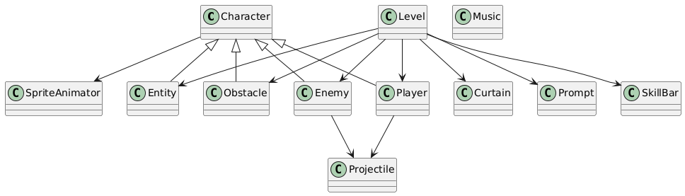

# 2025-group-5
2025 COMSM0166 group 5

## Dragon Adventure

Link to your game [PLAY HERE](https://uob-comsm0166.github.io/2025-group-5/)
The Canvas: https://editor.p5js.org/chyx-17/full/gs4csAz5Y
change color：press 'R','G', 'B'.
change shape: press '1','2','3'.

Your game lives in the [/docs](/docs) folder, and is published using Github pages to the link above.

Include a demo video of your game here (you don't have to wait until the end, you can insert a work in progress video)

## Kanban Link
https://wuxiaoalfie.atlassian.net/jira/software/projects/MFLP/boards/1

## Your Group

- Group member 1, Jingwei Lin, qw24858@bristol.ac.uk, ZhiyiJaved
- Group member 2, Xiao Wu, ev24875@bristol.ac.uk, Alfie-wuxiao
- Group member 3, Shaojie Yang, av24455@bristol.ac.uk, YYYYWhy
- Group member 4, Yaoyao Shen, bz24315@bristol.ac.uk, YasmineShen
- Group member 5, Xinyi Zhou, qp24615@bristol.ac.uk, Neltharion-Z
- Group member 6, Yaxin Chen, mq24914@bristol.ac.uk, chyx-17

## Project Report

### Introduction

**Dragon Adventure** is a 2D pixel-art action-adventure game that fuses **souls-like difficulty** with a **narrative-first progression system**. Rather than relying on flashy weapons or random upgrades, the game challenges players through **intentional design**, where every mechanic is grounded in story, and every obstacle is thematically justified.

At the heart of the experience is a three-layered design philosophy:

1. **Punishing but Purposeful: Souls-Like Difficulty**  
   Combat in *Dragon Adventure* is unforgiving. Enemies hit hard, and healing is limited. Players must master timing, spacing, and strategic movement. But this isn’t difficulty for its own sake—each challenge is crafted to evoke tension, risk, and eventual satisfaction. Inspired by *Souls* games, we aim for difficulty that **feels earned**, not random.

2. **Story as the Driver of Challenge**  
   Every difficulty spike in the game comes from the narrative. In Chapter 2, after defeating the first boss, players are **cursed and lose most of their vision**. This isn’t fog or visual blur—it’s a **narrative-induced blindness** that forces players to **explore in near-total darkness**, relying on memory, audio cues, and deduction. This immersive mechanic reinforces the story world while redefining how players perceive and navigate danger.

3. **Transformation: Strategic Empowerment Through Narrative**  
   To survive such extreme conditions, players rely on the core **transformation system**. By defeating monsters, they can temporarily **absorb their abilities**—such as gaining extra health, new attacks, or **curing negative status effects** like blindness. These powers are not just upgrades—they’re responses to the world’s cruelty, giving players **narrative-justified tools to push forward**.

A typical scenario in Chapter 2: with vision severely limited, the player faces an elite enemy with low HP but devastating attacks. Only by defeating and **transforming into that monster** can they gain the clarity and strength needed to progress—turning despair into strategy.

This tight synergy between **punishment, narrative, and tactical agency** defines *Dragon Adventure*. The result is a difficulty that is not just hard, but **immersively, meaningfully hard**—and always conquerable through understanding, memory, and adaptation.

### 📋 Requirements

To structure and guide our development, we followed a six-step requirements engineering process:

1. **Stakeholder Identification** 
2. **Understanding Environment & Capabilities** 
3. **Market Research & User Persona Analysis** 
4. **Definition of Top-Level Needs** 
5. **Epic and Acceptance Criteria Design** 
6. **Innovative Prioritization Evaluation**

---

### 1. 🎯 Stakeholders & Environment Awareness

We began by identifying our direct stakeholders: 
- **Target players** 
- **Team contributors (devs, designers, artists)**

> 📌 *This report intentionally omits instructors and TAs as direct stakeholders—this decision and its retrospective impact will be discussed in the Conclusion section.*

This step sharpened our understanding of our team’s environment: 
a small, cross-functional group with limited resources but creative freedom. Recognizing our technical constraints and the competitive class setting, we asked: 
> “How do we differentiate ourselves meaningfully?”

---

### 2. 🔍 Research & Differentiation

We observed that pixel shooters like *Enter the Gungeon* and *Broforce* focus heavily on **moment-to-moment action** but lack cohesive **story structures**:

- “No comprehensible story” – *Rock Paper Shotgun, 2015 (Broforce)* 
- “A gun that kills the past, but little else” – *PC Gamer, 2016 (Gungeon)* 
- Developers of *Nuclear Throne* admitted to writing only “the bare minimum” (Edge, 2015)

Meanwhile, **YouGov (2024)** reports 53% of players now prefer **narrative-based single-player games**, and **Isbister (2017)** confirms narrative significantly boosts **emotional immersion and retention**.

This inspired us to build a player experience around two top-level design goals:
- **Immersive Narrative Integration**
- **Challenge and Growth through Player Agency**

---

### 3. 🧩 Epic: Immersive Narrative Experience

**User Story** 
> As a player, I want the story and gameplay to feel interconnected, so that my actions have meaning in the world.

---

**AC1. World Introduction via Story Cutscene** 
Players begin the game with a short (30s) illustrated cutscene and narration.

📌 **Backlog (evolving):**
- [✓] Text-based intro → upgraded to narrated illustrated panel sequence 
- [✓] Included 3+ lore beats (curse origin, player identity, stakes) 
- [✓] Synced VO and scene transitions post-feedback

---

**AC2. Transitions + Narrative-Based Mechanic Intro** 
Each level features recap content, and new mechanics are introduced narratively.

📌 **Backlog (iterative):**
- [✓] Comic panels used between major zones (Forest → Graveyard) 
- [✓] Vision-restricting mechanic introduced through “curse” lore 
- [ ] Tutorial validation missing (e.g., no confirmation for mechanic understanding)

🛠️ *Observation*: Players appreciated the narrative flow, but hinted at slight onboarding confusion.

---

### 4. 🧠 Epic: Challenge and Growth

**User Story** 
> As a player, I want to grow through experience and overcome increasingly complex challenges using my earned abilities.

---

**AC1. Use of Past Abilities to Solve New Problems** 
Players should use acquired powers (e.g., transformations) to deal with new mechanics or hazards.

📌 **Backlog:**
- [✓] Transformations mapped to mechanics (e.g., recover vision after curse) 
- [✓] Visual indicators updated to show ability usage 
- [ ] Future scaling still manual—not adaptive

---

**AC2. Multi-Layered Difficulty Design** 
Each level combines combat AI, spatial layout, and visual limitation to create “Souls-like” challenge.

📌 **Backlog:**
- [✓] Graveyard’s vision limitation increases mental load 
- [✓] Enemies have dash-speed boost within aggro range 
- [✓] Limited enemy vision allows skilled players to "kite" effectively 
- [ ] Future: optional hints for stuck players (currently in “Could Have” tier)

🛠️ *Insight*: The balance between enemy aggression and player escape window offered satisfying tension.

---

### 5. 🗂️ Value-Oriented Prioritization

We adopted **Planning Poker** not only for estimating **effort**, but also for **evaluating player value**—an innovative extension beyond typical Scrum practice.

After consensus rounds, we mapped the results onto a **MoSCoW model**, enabling binary classification by both value and cost.

| Priority | Key Features |
|----------------|------------------------------------------------------------------------------|
| **Must Have** | Core combat loop, vision mechanic, transformation-based progression |
| **Should Have**| Comic-style transitions, narration, visual hints for ability usage |
| **Could Have** | In-game guidance systems, ability combination logic, bonus areas |
| **Won’t Have** | Online real-time multiplayer (high cost, low narrative fit) |

---

### ✅ Summary

Through structured analysis and iterative reflection, we transformed abstract aspirations into testable design goals. Our requirements engineering was grounded in:

- **Contextual awareness of team limits and user demand** 
- **A narrative–mechanic fusion model for challenge and story** 
- **Player-driven growth via logically integrated abilities** 
- **Innovative prioritization** using Planning Poker + MoSCoW synthesis

Crucially, our product backlogs were never static—they **evolved based on evaluation feedback, development feasibility, and playtest data**. This flexibility ensured that *Dragon Adventure* could stay responsive without sacrificing vision.

### Design

This section outlines the design process of the game system, starting from the user-centered use case model and progressing through architectural decomposition, class design, and behavioral modeling. Along the way, we reflect on key lessons and iterative improvements that shaped the final structure.

#### Use Case Model: From Player Perspective

Our design began with constructing a use case model to capture the interactions between the player and the game system. As shown in the diagram, we identified core gameplay features such as **defeating monsters**, **opening chests**, **reading signs**, **entering the next level**, **adjusting settings**, and **viewing story scenes**. These use cases gave us a clear starting point: what the player can do and what the system must support.

Initially, our focus was narrowly placed on combat actions like defeating enemies or progressing levels. We neglected utility and narrative interactions such as settings adjustment or environmental reading. Later iterations added use cases like “Read Sign Content” and “Press ESC to Adjust Settings,” enhancing player immersion and control. Including contextual actors (e.g., Monster, Sign, Settings) further clarified responsibility boundaries, a valuable step for modular game logic.

#### Architectural Design: Modular Decomposition

Based on the use case model, we then designed a modular architecture to meet these functional requirements. The system is structured into several independent yet connected modules: **Core Entities**, **UI & HUD**, **Audio Manager**, **Level Manager**, and a centralized **Game Loop**. These modules run inside a browser environment, orchestrated via JavaScript and Phaser 3 library.

A practical lesson we learned here was the importance of **reverse mapping from use cases to modules**. For example, the “Level Selection” case justified the Level Manager, while “Adjust Volume” motivated an independent Audio Manager. One critical improvement was centralizing the update() logic within the Game Loop. Early versions had entity-specific update methods called independently, which led to desynchronized rendering and inconsistent behavior. Refactoring to a centralized loop significantly improved stability and debuggability.

#### Class Design: Inheritance and Entity Specialization

With the system modules defined, we moved to class-level design. A core part of this was modeling the **Character** superclass, from which **Player**, **Enemy**, **Obstacle**, and **Projectile** inherit. Each subclass implements its specialized behavior while reusing shared logic such as movement, state management, and health tracking.

In our first attempt, we placed all logic in a monolithic `Entity` class to achieve reuse, but this led to bloated, unmanageable code. The move to a polymorphic hierarchy was a major breakthrough, improving maintainability and clarity. Each entity class (e.g., Enemy or Player) now encapsulates only the behaviors it owns, like patrol or shooting for enemies, and keyboard control for the player.

We also implemented reusable UI components like `Curtain` and `Prompt`, which were originally hardcoded into the game loop. Refactoring them into standalone classes with consistent display() and update() interfaces made them modular and extensible.

#### Level Configuration: Beyond Hardcoding

A critical turning point in our design thinking occurred during level design. At first, we hardcoded level layouts and enemy stats using embedded JSON files. This approach worked for prototyping but lacked scalability and flexibility.

Initially, we only focused on class inheritance for code reuse, and in terms of level design, we only thought of hardcoding configuration files. Later, we realized that **level configuration could serve as a parameterization tool**—by designing configuration files to define enemy types, positions, trigger zones, and even map styles, we could decouple gameplay logic from level content. This not only maximized code reuse but also empowered non-programmers to participate in level design by simply editing config files. This approach turned into a core strategy in our design: **code handles behavior, configuration defines variation**.

#### Sequence Modeling: Dynamic Behavior Over Time

To visualize how entities interact over time, we created sequence diagrams showing player and system interactions across the **Game**, **Level**, **Player**, and **Enemy** components. The diagram illustrates how starting a level triggers `init()` and `create()` methods, how player input results in movement or shooting, and how updates propagate through the game loop.

One lesson we learned here was the importance of consistent interfaces. By requiring each major entity to implement an `update()` method, we ensured they could all be synchronized in the game loop. Collision detection (`collisionCheck()`), rendering, and state transitions became easier to debug and extend.

#### Reflective Lessons and Design Techniques

Throughout this iterative design process, several key lessons emerged:

- **Start from user behavior**, not implementation. Designing from the player's perspective helped ensure gameplay was intuitive and feature-complete.
- **Abstract progressively**: move from high-level use cases to concrete modules, then into object-oriented classes and finally dynamic sequences.
- **Centralize game loop logic** to maintain update consistency across the system.
- **Favor configuration over hardcoding** for flexibility in level and gameplay tuning. This shift was crucial in making the game scalable.
- **Use interface unification** (e.g., common update(), display()) to enable polymorphic handling and simplify integration.

Each stage of the design involved rethinking and refactoring. Our initial plan emphasized inheritance for code reuse but ignored flexibility. By re-examining level design as a configuration-driven system and enforcing modular behaviors, we arrived at a structure that was both elegant and practical for long-term development.

### Implementation

To ensure that development remained focused and manageable, our team adopted a top-down implementation strategy, dividing the project into three primary domains:

- **Core combat system development**  
- **Level and progression integration**  
- **Art and visual design**

During the **first phase**, all members collaborated in **pair programming** mode to quickly establish a functional game demo. Agile stand-up meetings were held daily to align progress, share blockers, and re-evaluate priorities. This phase emphasized fast iteration, shared code ownership, and early discovery of architectural risks.

As we transitioned into the **second phase**, work became more specialized. The team split into **visual development** (responsible for environment art, UI, animations, and narrative illustration) and **code development** (handling combat mechanics, AI, system optimization). Integration checkpoints ensured continuous alignment across modules.

Despite the division of responsibilities, we encountered multiple **cross-domain challenges**—particularly in aligning visual expectations with system limitations, or ensuring narrative and environment assets could support the intended gameplay mechanics. Below are **three representative implementation challenges**, each corresponding to one of the project’s top-level goals.

---

#### 🧠 Challenge 1: Dynamic Monster Behavior for Strategic Combat  
(Corresponding to: **Challenge and Growth**)

- **S (Situation)**  
  Static or passive enemies failed to provide a meaningful threat. To maintain tension and reward strategic thinking, we needed enemies to react intelligently to the player’s presence.

- **T (Task)**  
  The team was tasked with building monsters that could patrol autonomously and dynamically switch to an aggressive chase mode when players entered a detection radius. Pathfinding and obstacle avoidance were required for realistic movement.

- **A (Action)**  
  Patrol routes were defined via JSON, with a state machine controlling transitions between idle, patrol, and tracking. Detection radius triggered pursuit behavior, and a waypoint-based rerouting system was implemented to handle blocked paths or narrow corridors.

  🔀 **Cross-domain Special Consideration**  
  During testing, monster patrol zones occasionally overlapped with **decorative tiles or foreground assets** placed by the art team that the engine didn’t recognize as obstacles. This caused unpredictable AI behavior. Since we were not using a full tilemap collision editor, the solution we adopted was pragmatic: **artists manually marked walkable and blocked tiles using an Excel sheet**, labeling positions and layers for each zone. While rudimentary, this approach created a shared communication layer that helped programmers configure collisions correctly based on artistic intent.

- **R (Result)**  
  The system introduced unpredictability and threat to enemy encounters. Players could no longer rely on fixed patterns, resulting in more adaptive and engaging combat. It also served as a foundation for future AI upgrades like group coordination or ranged tactics.

---

#### 🔁 Challenge 2: Player Transformation and Skill System  
(Corresponding to: **Challenge and Growth**)

- **S (Situation)**  
  To support meaningful progression and combat variety, we aimed to allow players to absorb and use abilities from defeated monsters. This would also reflect the narrative arc of internalizing enemy power.

- **T (Task)**  
  The team needed to design a modular transformation system, allowing players to temporarily take on new forms and skillsets while maintaining balance and performance.

- **A (Action)**  
  A shared `Character` superclass was used for both players and monsters. A modular `Ability` class encapsulated reusable skill data. When a player transformed, the system cached their base state and swapped in new attributes. Configuration files drove stat definitions and skill effects. The UI and animation were dynamically updated based on transformation state.

  🔀 **Cross-domain Special Consideration**  
  Monster transformation required **distinct visual forms**, but the art team initially only produced static enemy sprites. To unblock development, the programming team implemented **placeholder effects**—like glows and overlays—while artists prepared the final forms. This approach ensured parallel progress and avoided system bottlenecks due to pending assets.

- **R (Result)**  
  This system gave players a sense of tactical agency, letting them choose ability paths suited to their playstyle. It dramatically increased replayability and combat depth, and received highly positive feedback during test sessions.

---

#### 🎨 Challenge 3: Visual Storytelling Through Environment and Animation  
(Corresponding to: **Immersion and Narrative Progression**)

- **S (Situation)**  
  Cutscenes alone were insufficient to convey emotional progression. The team wanted players to “feel” the story through changing environments and character visual feedback.

- **T (Task)**  
  Our task was twofold: (1) implement an animation system that reflected combat states clearly (e.g., hit, invincible, attack), and (2) embed narrative elements into environmental transitions using visual motifs and illustrations.

- **A (Action)**  
  The animation system used a timer-based `Animation` class to switch frames based on character status, including blinking for invincibility. Meanwhile, level artists developed four distinct environmental stages (Forest → Graveyard → Lake → Lava), each with a specific color theme and narrative role. Comic-style panels were created to bridge stages, and interactive objects were themed accordingly (e.g., chained gates, cursed mist).

  🔀 **Cross-domain Special Consideration**  
  Some visual proposals—like **animated fog overlays or dynamic lava flows**—clashed with engine limitations, causing masking and performance issues. The teams coordinated to rework these as **parallax-safe static layers or looped effects**, and introduced strict conventions for asset layering and naming. This kept performance stable while preserving artistic impact.

- **R (Result)**  
  Visual feedback improved player decision-making and immersion. Environmental storytelling helped reinforce the world’s emotional arc without relying on dialogue. Players consistently commented on the atmospheric tension and narrative continuity between zones.

---

#### 📊 Summary of Key Challenges and Outcomes

| Challenge | Goal | Solution | Cross-Domain Friction | Result |
|----------|------|----------|------------------------|--------|
| **Monster AI** | Increase tension and strategic depth | Patrol + Aggro system, rerouting with waypoints | Manual collision mapping via Excel to resolve art-program mismatches | More dynamic encounters, better challenge pacing |
| **Player Transformation** | Enable progression and build diversity | Config-driven ability system, dynamic state swap | Delay in final sprites led to fallback FX collaboration | High replayability, player-driven combat strategy |
| **Environment & Animation** | Deepen immersion and storytelling | Themed environments + responsive animation | Performance tuning due to animated visual layers | Strong narrative tone, enhanced player clarity |

### Evaluation

To evaluate whether our design and implementation successfully delivered an immersive, strategically challenging experience, we conducted a user-centered evaluation using both **qualitative** and **quantitative** methods. Specifically, we employed:

1. **Think-Aloud Protocols** — to capture real-time user thoughts and frustrations during gameplay, guiding iterative design.
2. **NASA Task Load Index (NASA-TLX)** — to quantitatively compare perceived cognitive and physical workload across levels.

This dual-method approach helped us refine key features, validate design assumptions, and align player experience with our stated top-level goals: **Challenge and Growth** and **Immersive Narrative Integration**.

---

#### 🧠 Think-Aloud Testing: Iterative Feedback and In-Game Adjustments

We invited a group of users, our classmates in fact, (N = 6) to play through the first two levels while narrating their thought process aloud. Sessions were recorded and tagged based on observed frustrations, expectations, surprises, and suggestions.

Key findings and responses included:

| **User Observation** | **Design Response** |
|---------------------------------------------------------------|-------------------------------------------------------------------------------------|
| *“I finished the level and nothing really happened... was that it?”* | 🚀 We added **level-clear animation and story recap panels** to create visual closure and narrative flow. |
| *“It’s hard to tell if the monster sees me or not.”* | 👁️ We plan to add **subtle sound and sprite cues** when enemies switch from idle to aggro. |
| *“It’s too hard. I didn’t know what I was supposed to do.”* | ⚠️ Added to the **“Could Have” backlog**: contextual tips or hint popups during peak difficulty spikes. |
| *“I like that I got a new ability, but I wasn’t sure how to use it.”* | 🎯 We improved the **UI feedback for new abilities**, including an indicator and number hint. |

These observations directly influenced multiple polish and UX updates across all levels. The Think-Aloud approach also helped us identify **non-obvious pain points**, especially in transitions, ability clarity, and feedback consistency—areas which are difficult to surface via analytical method of ourselves.

---

#### 📊 NASA-TLX Workload Comparison: Forest vs. Graveyard Levels

To evaluate the **cognitive and physical workload** imposed by our level design, we conducted a **within-subject** NASA Task Load Index (NASA-TLX) assessment. Each participant (N = 6) completed both the **Forest (Level 1)** and **Graveyard (Level 2)** levels in sequence, then rated the workload dimensions immediately after each level.

##### Summary of Results:

| **Dimension** | **Forest (Level 1)** | **Graveyard (Level 2)** |
|----------------------|----------------------|--------------------------|
| Mental Demand | 42.5 | **71.3** 🔺 |
| Physical Demand | 25.2 | 33.0 |
| Temporal Demand | 36.1 | 65.4 |
| Effort | 44.8 | **70.1** 🔺 |
| Frustration | 28.0 | 40.7 |
| Performance (Reverse)| 55.5 | **67.2** 🔺 |

(*Scores normalized to 0–100 scale, higher = more intense*)

##### Interpretation:

The **Graveyard level introduced a dynamic vision-limiting mechanic**, simulating a cursed effect from the Chapter 1 boss. This constraint increased:
- **Mental load** (players needed to memorize or infer map layout)
- **Effort** (required more cautious movement and combat)
- **Temporal pressure** (due to ambush-prone design and reduced visibility)

Yet despite the added difficulty, players **reported higher satisfaction scores for perceived performance** in the Graveyard level, suggesting that the added challenge felt **earned rather than unfair**.

🔍 **Conclusion:** 
The data confirms our design intent: the **vision-limiting mechanic successfully raised difficulty**, but also **deepened immersion and player satisfaction**—fulfilling our “Immersive Narrative” and “Challenge and Growth” requirements simultaneously.

---

#### ✅ Evaluation Insights & Design Confirmation

Based on both qualitative feedback and quantitative workload data, we can conclude:

- Players want to be **challenged—but with clarity**.
- Even subtle **narrative or visual cues** (e.g., animations, hint text) significantly improve onboarding and player confidence.
- Our **Level 2 vision mechanic** achieved the desired increase in difficulty without triggering frustration, validating its inclusion as a core mechanic.

This evaluation stage not only helped verify core design decisions, but also informed our roadmap priorities—focusing future development on **enhanced feedback systems**, **adaptive challenge design**, and **optional hint mechanics**.

---

#### Code Testing

**Unit Testing** 
Throughout the development process, we conducted extensive unit testing on key game modules and features. Using the JUnit framework, we wrote over 200 test cases covering core mechanics, character systems, combat systems, item systems, and other aspects of the game. These test cases ensured that each independent module worked correctly before being integrated into the main game system.

**Integration Testing** 
After completing unit tests, we conducted integration testing to verify the compatibility of different modules working together. During this phase, we identified and fixed several cross-module compatibility issues, such as synchronization problems between character movement and collision detection, as well as state update issues between item usage and the combat system. These fixes ensured the stability and smoothness of the game.

**System Testing** 
Finally, we conducted system testing to assess the game's performance and compatibility across different platforms and devices. By simulating various user scenarios and extreme conditions, we verified the game's stability and response speed under various conditions. The system testing results showed that the game performed well on mainstream devices, but we also optimized it for low-end devices to ensure a broader user base could enjoy a good gaming experience.

### Process 

#### Overview
| **Phase**                             | **Dates**      | **Focus**                                                                           | **Aligned Requirement Themes**                                                       |
| ------------------------------------- | -------------- | ----------------------------------------------------------------------------------- | ------------------------------------------------------------------------------------ |
| **Core Prototype**                    | Jan 28 – Mar 3 | Player & enemy class logic; HP, attack, movement; base visual mapping               | 🔸 *Challenge and Growth* foundation; mechanic feasibility                           |
| **Single-Level Integration**          | Mar 4 – Mar 18 | Monster types, environment visuals, gameplay–art merge for one full level           | 🔸 *Immersive Narrative* (Level + Visual unity)                                      |
| **Multi-Level & Config-Based Design** | Mar 18 – Apr 8 | Configurable logic, vision mechanics, new monster abilities, narrative scripting    | 🔸 *Challenge + Narrative Integration* (fog of war, transformation, branching logic) |
| **System UI & Experience Polish**     | Apr 9 – Apr 22 | Menu systems, transitions, inter-level logic, prompts, tooltips                     | 🔸 *UX clarity, onboarding, non-core gameplay loop support*                          |
| **Final Evaluation & Polish**         | Apr 23 – May 7 | Think-aloud response implementation, NASA-TLX tuning, polish, animation, hint hooks | 🔸 *Responsive Design + Validation of Immersion & Challenge*                         |

#### Team Structure and Evolution

Our six-person game development team underwent a **natural evolution in collaboration structure**, transitioning from exploratory cooperation to a dual-track production model.

At the project’s outset, we aimed to follow a **classic Agile structure**, assigning hypothetical roles such as product owner, developer, and designer based on general principles. However, we soon realized that we **lacked a deep understanding of each other’s strengths, working preferences, and design instincts**. Early assignments revealed mismatches between skill sets and tasks, and strict roles occasionally constrained creativity and morale.

#### Phase 1: Unified Exploration Through Pair Programming (Before March 18)

In the initial phase, we agreed to **focus solely on building a working combat prototype**, postponing narrative, art, and polish. Our guiding principle was: **“Code first, meaning later.”** This decision allowed all members to engage directly with the most abstract and difficult part of game development—**core gameplay logic**—while gradually forming a shared mental model of how the game could evolve.

We practiced **rotating pair programming**, forming dynamic pairs that collaborated on movement, shooting, and collision systems. This flexible approach helped us:
- Rapidly build a working **gameplay demo**;
- Cultivate empathy between designers and coders;
- Ensure every member gained baseline proficiency in front-end JS development.

Though we lacked a dedicated art pipeline, we reached a point where placeholders were necessary. At that time, we used **WeChat as a lightweight task board**, posting requests like "We need a basic enemy sprite to test aggro range." This strategy allowed us to **gauge interest and initiative**. Naturally, Xiao Wu, Yaxin Chen, and Yaoyao Shen began leading visual development tasks, while Jingwei Lin, Shaojie Yang, and Xinyi Zhou gravitated toward code.

This shared hands-on foundation proved invaluable later—**everyone could read and reason about code**, enabling better cross-domain communication down the line.

#### Phase 2: Formation of Two Interlocking Sub-Teams (After March 18)

Following the completion of our demo, we entered a more structured phase and naturally split into **two sub-teams**:

- **Visual Development Team**: Xiao Wu (narrative/story panels), Yaxin Chen (level/environment design), and Yaoyao Shen (transitional and UI visuals).
- **Software Engineering Team**: Shaojie Yang and Xinyi Zhou (main development pairs), with Jingwei Lin (developer-tester and design–engineering bridge).

##### Visual Development Team: Flexibility With Ownership

The visual team adopted a **modular, task-oriented approach** to content creation, maintaining consistent style across different story and interface components:
- Xiao Wu focused on **narrative cohesion**, designing story cutscenes and environmental storytelling cues.
- Yaxin Chen led **level mechanism ideation**, including cursed vision and stage-specific hazards.
- Yaoyao Shen specialized in **interface and transitional moments**, ensuring the emotional and functional bridge between gameplay scenes.

Though flexible, the team loosely followed the principles of **requirement engineering decomposition**: dividing story, interaction, and presentation roles across interdependent subsystems, often aligning with Acceptance Criteria defined earlier.

##### Engineering Team: Agile Execution and Cross-Syncing

The engineering team upheld a rigorous **pair programming model**, adhering to Agile principles:
- Daily standups ensured shared awareness and load balancing.
- Jira was used for tracking backlog items, tasks, and progress milestones.
- Continuous integration workflows enabled stable testing and deployment.
- Frequent code reviews maintained **code quality and shared knowledge**.

A special role emerged: **Jingwei Lin acted as the technical bridge** between design and development. While primarily focused on testing and system-level integration, Jingwei continuously **updated the visual team on the engine’s current capabilities**. This prevented overambitious ideas from being proposed before they were technically feasible, creating **mutual understanding between creativity and constraint**.

---

#### Reflections and Learnings

Looking back, our team structure reflects not rigid methodology, but **practical adaptability**:
- We **started without fixed roles**, discovering strengths through action rather than assumptions.
- We **unified around building something tangible first**, which grounded later abstract design decisions.
- We then **segmented along natural skill boundaries**, not top-down roles.
- Crucially, our **communication channels remained open and bi-directional**, with designers participating in code, and developers contributing to design thinking.

This hybrid model not only improved productivity but **enhanced mutual respect and cross-domain empathy**—which we believe is the cornerstone of any successful creative software project.

#### 🌀 Weekly Process and Sprint Rhythm

Our team followed a **weekly sprint-based development cycle**, combining structured Agile routines with natural team dynamics. The rhythm allowed us to concentrate collaboration, leave room for individual execution, and maintain a constant feedback loop.

#### 📆 Weekly Development Schedule

| **Stage**               | **Activity Description**                                                                                                                                         | **Time Slot**                          | **Collaboration Outcome**                                 |
|-------------------------|------------------------------------------------------------------------------------------------------------------------------------------------------------------|----------------------------------------|------------------------------------------------------------|
| **Sprint Planning**     | After Monday's lecture, we spent one hour refining the week's goals. Using past effort data, we adjusted story points and selected realistic targets.            | Monday (post-lecture, 1 hr)            | Re-alignment & planning                                    |
| **Synchronous Work**    | Tuesdays (lab + post-lab) and Thursday’s final class slot were our main joint dev sessions. ~60% of all collaborative work was completed during this window.     | Tuesday (full) + Thursday (evening)    | Pair programming, core feature integration                 |
| **Independent Progress**| Members completed supporting tasks independently—e.g., polishing, asset design, minor bugs—based on progress from the sync stage.                                | Wednesday–Thursday                     | Individual advancement                                     |
| **Team Building & Sync**| Fridays were used for team activities (e.g., hiking), which doubled as informal face-to-face syncs. We discussed blockers, refined features, and added new needs.| Friday (team activity)                 | Final merge, backlog reflection, new idea generation       |

---

#### 🧪 Practical Examples

- After completing the **demo in mid-March**, we used a Friday hiking session to sync on the **“cursed vision mechanic”**. This mechanic was then confirmed as a key feature in the Graveyard level, both technically feasible and narratively powerful.

- In another Friday reflection, we recognized that **“level-complete animations”** were missing. Following a team-wide discussion, we scheduled them for visual implementation and successfully enhanced the sense of progress and narrative continuity.

---

This rhythm allowed us to maintain a healthy balance between focused collaboration and flexible creativity—empowering both our **engineering and design sub-teams** to thrive while staying aligned.

### 🧾 Conclusion

Looking back on the full development cycle of *Dragon Adventure*, our team reflects with both pride and humility. We began this journey with a clear creative ambition: to build a pixel-art action game that goes beyond fast-paced combat and introduces players to a meaningful, narrative-rich world. And while we achieved much of that vision, the path to it was nonlinear and filled with learning curves.

One of our greatest achievements was the **integration of narrative and gameplay**, which remains a rarity in the pixel shooter genre. Through features such as **vision-limiting mechanics**, **enemy ability inheritance**, and **environment-driven storytelling**, we created a world that responds to the player both mechanically and emotionally. Our Graveyard level in particular demonstrated how design innovations like fog of war can increase difficulty while also deepening immersion. Players not only overcame new mechanical challenges, but also felt the story tighten around them.

We also succeeded in realizing many of our key top-level goals from requirements engineering. Our user stories around *Challenge and Growth* led to modular systems like the **transformation mechanic**, which allowed players to tactically adapt by absorbing enemy skills. Meanwhile, the narrative integration criteria pushed us to implement visual transitions and lore-tied cutscenes that strengthened story continuity. These successes were validated in our **evaluation phase** through both **think-aloud studies** and **NASA-TLX** workload assessments, which confirmed that players felt a real increase in challenge and satisfaction from our design decisions.

But these highlights were only possible because of the solid foundation we built during the early technical phases. The game architecture, from a centralized game loop to modular `Character` classes and JSON-driven level configuration, enabled us to iterate rapidly while maintaining structural coherence. Our design philosophy of **“code defines behavior, config defines variation”** gave the team—including non-programmers—the ability to contribute meaningfully throughout the process.

That said, our journey was far from perfect. At the beginning, we had little concept of what software engineering truly required. We operated on instinct and informal coordination, often underestimating the importance of planning tools and structured workflows. It took us almost six weeks to build the prototype, which—while educational—left us with less time for polish and extra features. As deadlines approached, we often found ourselves racing against time, forced to leave several valuable ideas (such as dynamic player hint systems or deeper branching narrative paths) in the backlog.

While our weekly Friday team-building sessions played an important role in team cohesion and project continuity, they were also our **only retrospective mechanism**. In contrast to standard Scrum practices—where *retrospective* and *review* meetings are formally distinct—we combined both into casual discussions. Though emotionally supportive, this approach may have hindered deeper technical and stakeholder engagement. In hindsight, if we had reached out earlier to other teams, TAs, or even Ruzanna, we could have better utilized the **external support systems** available to us. Some important insights were simply realized too late to act on.

Through this experience, we also came to better understand ourselves as collaborators. By the project’s midpoint, we organically divided into specialized teams, improving both speed and morale. However, we acknowledge that our **collaboration tools were not always structured**, and task tracking could have been more rigorous. Learning from this, we are now better equipped to build high-functioning workflows from day one.

Going forward, we feel more confident as software developers and designers. We’ve learned that great games aren't just the result of creativity but of disciplined iteration, collaborative compromise, and well-scaffolded architecture. In future versions or projects, we aim to build on our current systems by expanding feedback loops (e.g., rewards for ideal play), offering smarter in-game hints, and possibly developing deeper multiplayer or side-story modules that enrich the lore and increase replayability.

> In short, *Dragon Adventure* was not just a game we made — it was the process through which we became a true game development team.

### Contribution Statement

| Name            | Role                   | Primary Responsibilities                                                                                                                                     | Notes                                                                                                    |
|-----------------|------------------------|---------------------------------------------------------------------------------------------------------------------------------------------------------------|----------------------------------------------------------------------------------------------------------|
| **Shaojie Yang**  | Programmer              | Combat system, monster AI, **full in-level tech implementation**, pair programming                                                                            | Led patrol/routing logic; implemented all interactive monster behavior and obstacle interactions.        |
| **Xinyi Zhou**    | Programmer              | UI programming, **inter-level transitions**, configuration parsing, loading systems                                                                            | Focused on level selection, player state saving/loading, and polished system behaviors outside gameplay. |
| **Jingwei Lin**   | Technical Bridge & Writer | Testing, class design, **team structure evolution**, **requirement and report authorship**, UML/class diagrams                                                 | Played a key role in shaping cross-team collaboration; drafted major report sections and visual models. |
| **Xiao Wu**       | Narrative Designer      | Story system, worldbuilding, comic-style cutscenes                                                                                                             | Designed all narrative components; ensured story progression aligns with gameplay tone.                  |
| **Yaxin Chen**    | Game Designer           | Level layout logic, transformation mechanic, cursed vision system                                                                                             | Designed vision-restricting gameplay and transformation; structured configuration for monsters/maps.     |
| **Yaoyao Shen**   | Visual Designer         | UI assets, level-clear transitions, polish for menus and HUD                                                                                                   | Designed interface feedback, victory panels, and bridging visual elements.                              |

---

> 💡 **Note**: Despite differing focuses, all six members actively participated in **code review and collaborative development**, especially during the prototype and integration phases. This shared technical involvement fostered a strong team-wide understanding of the codebase.

> 🎯 Ultimately, every team member contributed with full dedication and effort, ensuring that *Dragon Adventure* could reach its final form as a polished, immersive experience. Our collective passion and resilience were the foundation of the project’s success.

### Additional Marks

You can delete this section in your own repo, it's just here for information. in addition to the marks above, we will be marking you on the following two points:

- **Quality** of report writing, presentation, use of figures and visual material (5%) 
  - Please write in a clear concise manner suitable for an interested layperson. Write as if this repo was publicly available.

- **Documentation** of code (5%)

  - Is your repo clearly organised? 
  - Is code well commented throughout?
